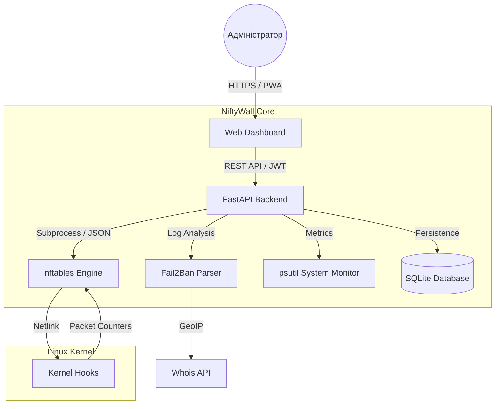

<p align="center">
  <a href="README_ENG.md">
    
  </a>
  <a href="README.md">
    
  </a>
</p>

<br>

<p align="center">
  
  
  
  
</p>

# 🛡️ NiftyWall "Hardened" - Bare Metal Edition [](https://github.com/weby-homelab/niftywall/releases/latest)

*Making Linux Firewalls Transparent, Smart, and Beautiful.*

**NiftyWall** — це професійний веб-дашборд для керування фаєрволом nftables. У версії v3.0.2 проект пройшов повний аудит для досягнення Enterprise-стабільності. Ця редакція (`classic`) оптимізована для роботи безпосередньо на хост-системі, забезпечуючи максимальну продуктивність та прямий доступ до Netlink API ядра.

---

## 🧩 Архітектура системи



---

## 🚀 Що нового у версії "Hardened"

- **🔐 SQLite Backend:** Усі стани перенесені в надійну БД SQLite. Вирішено проблему Race Conditions.
- **🛡️ Strict Input Validation:** Сувора валідацію всіх вхідних даних через Pydantic. Повний захист від NFT-ін'єкцій.
- **🕰️ Isolated Time Machine:** Бекапи працюють виключно з таблицею `niftywall`, не зачіпаючи правила Docker чи VPN.
- **🔄 Smart DNAT + SNAT:** Автоматичне додавання правил маскарадінгу для усунення проблем асиметричної маршрутизації.
- **🕵️ Resilient Fail2Ban:** Нова логіка парсингу, що працює напряму через `fail2ban-client`.

---

## 🛠️ Встановлення (Bare Metal Edition)

Оптимізовано для роботи за допомогою Systemd та Uvicorn на чистому Linux.

### 1. Попередні вимоги
- **Python** 3.10+
- **nftables** пакет (v1.0.9+)
- **fail2ban** пакет (для аналізу логів)
- Права **root** або **sudo**

### 2. Покроковий запуск
```bash
# Клонування репозиторію
git clone -b classic https://github.com/weby-homelab/niftywall.git /opt/niftywall
cd /opt/niftywall

# Налаштування Python
python3 -m venv venv
source venv/bin/activate
pip install -r requirements.txt

# Налаштування середовища
cp .env.example .env
# Генеруємо SECRET_KEY: openssl rand -hex 32
```

### 3. Налаштування Systemd
Створіть `/etc/systemd/system/niftywall.service`:
```ini
[Unit]
Description=NiftyWall Firewall Dashboard
After=network.target nftables.service

[Service]
User=root
WorkingDirectory=/opt/niftywall
ExecStart=/opt/niftywall/venv/bin/uvicorn app.main:app --host 0.0.0.0 --port 8000
Restart=always

[Install]
WantedBy=multi-user.target
```
```bash
systemctl daemon-reload
systemctl enable --now niftywall
```

---

## 📋 Детальні Системні Вимоги та Сумісність (Environments)

### 🟢 1. Ідеальне середовище (Native Bare Metal / Cloud VPS)
*Прозоре керування ядром без посередників.*
- **Як працює:** NiftyWall ініціалізує таблицю `inet niftywall` у стеку `nftables`. Використовується тип `filter` для ланцюгів `input` та `forward` з пріоритетом **-100**, що дозволяє обробляти пакети на ранніх етапах мережевого стеку.
- **Особливості:** Найвища швидкість обробки правил та 100% передбачуваність. Жодне правило не буде проігнороване сторонніми сервісами.

### 🟡 2. Змішане середовище (Сервери з Docker / LXC / KVM)
*Гармонійне співіснування з контейнеризацією.*
- **Концепція "Shield-First":** Завдяки пріоритету **-100**, NiftyWall стає "першим ешелоном" оборони. Пакети потрапляють у ваші правила **ДО** того, як вони будуть спрямовані в ланцюги `DOCKER-USER` або `FORWARD` пакетного менеджера Docker.
- **Ізоляція таблиць:** Робота у власному просторі імен (`table inet niftywall`) виключає ризик випадкового видалення правил Docker при оновленні конфігурації.

### 🔴 3. Вороже середовище (UFW або Firewalld)
*Ризик конфліктів та "затінення" правил.*
- **Проблема:** Оскільки `nftables` дозволяє паралельну роботу кількох таблиць, пакет має бути дозволений **в обох** системах одночасно. Це створює ситуації, коли NiftyWall дозволяє трафік, але застарілий менеджер його блокує "в тіні".
- **Рішення:** Рекомендується виконати `systemctl disable --now ufw` або `firewalld` перед активацією NiftyWall. Якщо вам потрібен GUI саме для них, використовуйте: [UFW-GUI](https://github.com/weby-homelab/ufw-gui) або [Firewalld-GUI](https://github.com/weby-homelab/firewalld-gui).

---

## 📥 Інші варіанти
Для швидкого запуску в ізольованому середовищі використовуйте гілку [main](https://github.com/weby-homelab/niftywall/tree/main) (Docker Edition).

---
<p align="center">
  Made with ❤️ in Kyiv under air raid sirens and blackouts<br>
  <strong>✦ 2026 Weby Homelab ✦</strong>
</p>
