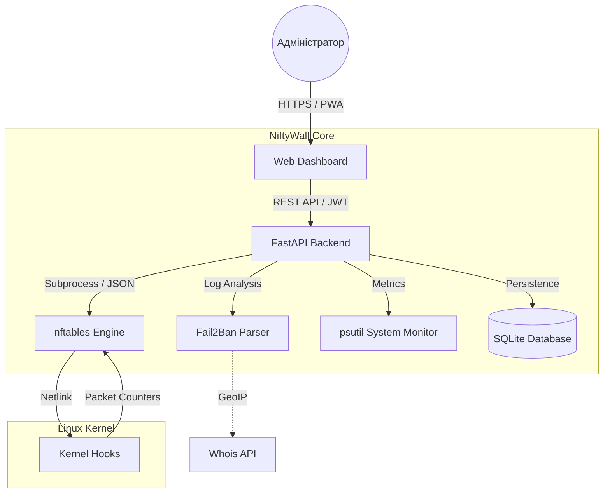

<p align="center">
  <a href="README_ENG.md">
    
  </a>
  <a href="README.md">
    
  </a>
</p>

<br>

<p align="center">
  
  
  
  
</p>

# 🛡️ NiftyWall v3.0.0 "Hardened" - Docker Edition [](https://github.com/weby-homelab/niftywall/releases/latest)

*Making Linux Firewalls Transparent, Smart, and Beautiful.*

**NiftyWall** — це професійний веб-дашборд для керування фаєрволом nftables. У версії v3.0.0 проект пройшов повний аудит для досягнення Enterprise-стабільності та безпеки. Ця редакція (`main`) оптимізована для швидкого розгортання в ізольованому середовищі Docker.

---

## 🧩 Архітектура системи



---

## 🚀 Що нового у v3.0.0 "Hardened"

- **🔐 SQLite Backend:** Усі стани (користувачі, логи, історія) перенесені в надійну БД SQLite. Вирішено проблему Race Conditions.
- **🛡️ Strict Input Validation:** Сувора валідація всіх вхідних даних через Pydantic. Повний захист від NFT-ін'єкцій.
- **🕰️ Isolated Time Machine:** Бекапи працюють виключно з таблицею `niftywall`, не зачіпаючи правила Docker чи VPN.
- **🔄 Smart DNAT + SNAT:** Автоматичне додавання правил маскарадінгу для усунення проблем асиметричної маршрутизації.
- **🕵️ Resilient Fail2Ban:** Нова логіка парсингу, що працює напряму через `fail2ban-client`.

---

## 🛠️ Встановлення (Docker Edition)

Цей метод забезпечує повну ізоляцію коду від хост-системи, використовуючи лише необхідні Kernel Hooks.

### 1. Попередні вимоги
- **Docker Engine** 24.0+ та **Docker Compose** v2.
- Наявність `nftables` у хост-системі (для завантаження модулів ядра).

### 2. Розгортання через Docker Compose
Створіть `docker-compose.yml`:

```yaml
services:
  niftywall:
    image: webyhomelab/niftywall:latest
    container_name: niftywall
    privileged: true # Необхідно для керування nftables
    network_mode: host # Необхідно для прямого доступу до інтерфейсів
    restart: always
    environment:
      - SECRET_KEY=${SECRET_KEY} # openssl rand -hex 32
      - PANIC_ALLOWED_PORTS=22,80,443,54322
      - TZ=Europe/Kyiv
    volumes:
      - /var/log/fail2ban.log:/var/log/fail2ban.log:ro
      - /var/run/fail2ban:/var/run/fail2ban
      - /opt/niftywall/data:/app/data
      - /opt/niftywall/snapshots:/app/snapshots
```

### 3. Запуск
```bash
docker compose up -d
```

---

## 📋 Сумісність та середовища

### 🟢 Змішане середовище (Docker / LXC / KVM)
NiftyWall ініціалізує таблицю `inet niftywall` з пріоритетом **-100**. Це означає, що ваші правила спрацьовують **ДО** того, як трафік потрапить у ланцюги Docker. Ви можете безпечно блокувати загрози на вході, не ламаючи мережу контейнерів.

### 🔴 Вороже середовище (UFW / Firewalld)
Обов'язково виконайте `systemctl disable --now ufw`, оскільки паралельна робота двох менеджерів призводить до "затінення" правил (пакет має бути дозволений в обох таблицях одночасно).

---

## 📥 Інші варіанти
Для максимальної продуктивності на VPS з обмеженими ресурсами (RAM < 512MB) використовуйте гілку [classic](https://github.com/weby-homelab/niftywall/tree/classic).

---
<p align="center">
  Made with ❤️ in Kyiv under air raid sirens and blackouts<br>
  <strong>✦ 2026 Weby Homelab ✦</strong>
</p>
