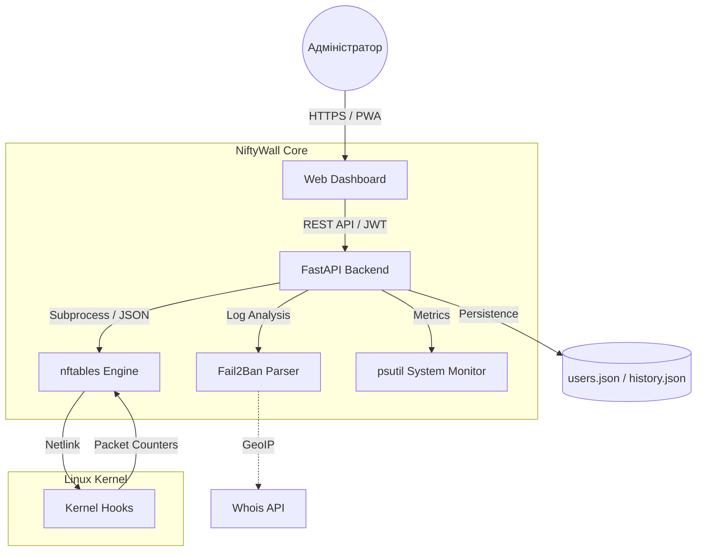

<p align="center">
  <a href="README_ENG.md">
    
  </a>
  <a href="README.md">
    
  </a>
</p>

# 🛡️ NiftyWall v1.5.2 "Smart Insights"
*Making Linux Firewalls Transparent, Smart, and Beautiful.*

[](https://github.com/weby-homelab/niftywall)
[](LICENSE)
[]()

**NiftyWall** — це професійний веб-дашборд для керування `nftables`, створений для тих, хто цінує швидкість, естетику та повний контроль. На відміну від UFW чи Firewalld, NiftyWall не створює "свій світ" правил, а працює безпосередньо з ядром Linux, візуалізуючи реальний стан вашого фаєрвола.

---

## 🧩 Архітектура системи



---

## ✨ Нове у версії 1.5.0 (Smart Insights)

- **📈 Системна аналітика:** Живі графіки завантаження CPU та RAM, а також історія стабільності Uptime.
- **📱 Повна мобільна адаптивність:** Новий "картковий" інтерфейс для смартфонів та скрол-таби.
- **🚀 Easy Onboarding:** Миттєва реєстрація першого адміністратора при запуску.
- **🌍 Інтелектуальний Whois:** Детальна інформація про провайдера та країну будь-якої IP в один клік.
- **🛡️ Fail2Ban Pro:** Можливість розбанювати IP безпосередньо з дашборду.

## 🚀 Ключові переваги

- **Direct nftables Engine:** Робота з нативним JSON-форматом nftables. Жодних конфліктів із правилами Docker.
- **🕰️ Time Machine (Snapshots):** Автоматичне створення знімків конфігурації перед кожною зміною. Безпечний відкат в один клік.
- **📈 Activity Monitoring:** Спарклайни для кожного правила показують активність трафіку (pkts/sec) в реальному часі.
- **🚨 Panic Mode 2.0:** Миттєве блокування всього зайвого зі збереженням доступу до SSH та самого NiftyWall.
- **🔀 Smart NAT:** Легке керування прокиданням портів з автоматичним налаштуванням ланцюжків FORWARD.

---

## 🛠️ Швидкий старт

### Через Docker (Рекомендовано)
```bash
docker pull webyhomelab/niftywall:latest
docker run -d --name niftywall --privileged --network host \
  -v /var/log/fail2ban.log:/var/log/fail2ban.log:ro \
  -v /var/run/fail2ban:/var/run/fail2ban \
  -v /opt/niftywall/snapshots:/app/snapshots \
  -v /opt/niftywall/data:/app/data \
  -e SECRET_KEY="your_secure_random_string_here" \
  webyhomelab/niftywall:latest
```
*Примітка: `--privileged` та `--network host` необхідні для прямої взаємодії з nftables.*

### Ручне встановлення (Ubuntu 24.04)
```bash
git clone https://github.com/weby-homelab/niftywall.git
cd niftywall
python3 -m venv venv && source venv/bin/activate
pip install -r requirements.txt
cp .env.example .env
# Запустіть сервіс через systemd (див. документацію нижче)
```

---

## 📜 Історія оновлень
- **v1.5.0**: Реліз "Smart Insights". Графіки, мобільний інтерфейс, Unban, Whois.
- **v1.4.1**: Smart Clone & Edit, автоматичні снапшоти, вдосконалений NAT.
- **v1.3.0**: Інтеграція з Fail2Ban (read-only), геолокація IP.

## 📋 Системні вимоги
- **ОС:** Ubuntu 24.04 (LTS) або сучасний Linux з ядром 6.8+.
- **Ядро:** nftables 1.0.9 або новіше.
- **Доступ:** Права `root` для керування правилами.

---
<p align="center">
  Made with ❤️ in Kyiv under air raid sirens and blackouts<br>
  <strong>✦ 2026 Weby Homelab ✦</strong>
</p>
