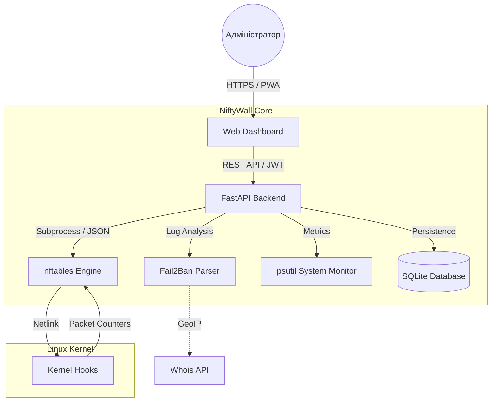

<p align="center">
  <a href="README_ENG.md">
    
  </a>
  <a href="README.md">
    
  </a>
</p>

# 🛡️ NiftyWall v3.0.0 "Hardened"
*Making Linux Firewalls Transparent, Smart, and Beautiful.*

[](https://github.com/weby-homelab/niftywall)
[](LICENSE)
[]()

**NiftyWall** — це професійний веб-дашборд для керування фаєрволом. У версії v3.0.0 проект пройшов повний аудит та рефакторинг для досягнення Enterprise-стабільності та безпеки.

---

## 🧩 Архітектура системи



---

## 🚀 Що нового у v3.0.0 "Hardened"

- **🔐 SQLite Backend:** Усі стани (користувачі, логи, історія) перенесені з JSON-файлів у надійну базу даних SQLite. Вирішено проблему Race Conditions.
- **🛡️ Strict Input Validation:** Впроваджено сувору валідацію всіх вхідних даних через Pydantic Regex. Повний захист від NFT-ін'єкцій.
- **🕰️ Isolated Time Machine:** Бекапи та відновлення тепер працюють виключно з таблицею `niftywall`. Система більше не зачіпає правила Docker чи VPN при відкаті.
- **🚨 Dynamic Panic Mode:** Можливість конфігурувати дозволені порти та інтерфейси через змінні середовища (`PANIC_ALLOWED_PORTS`).
- **🔄 Smart DNAT + SNAT:** Автоматичне додавання правил маскарадінгу (Masquerade) для усунення проблем асиметричної маршрутизації в NAT.
- **🕵️ Resilient Fail2Ban:** Нова логіка парсингу, яка не залежить від наявності лог-файлів та вміє запитувати статус напряму через `fail2ban-client`.

---

## 🛠️ Встановлення на Bare Metal (Гілка Classic)

Ця версія (`classic`) оптимізована для роботи безпосередньо на хості (без Docker) за допомогою Systemd та Gunicorn.

```bash
# 1. Клонування репозиторію та перехід на гілку classic
git clone -b classic https://github.com/weby-homelab/niftywall.git /opt/niftywall
cd /opt/niftywall

# 2. Налаштування середовища
python3 -m venv venv && source venv/bin/activate
pip install -r requirements.txt

# 3. Налаштування конфігурації
cp .env.example .env
# Відредагуйте .env і додайте надійний SECRET_KEY
# SECRET_KEY=$(openssl rand -hex 32)

# 4. Встановлення та запуск сервісу
cp niftywall.service /etc/systemd/system/
systemctl daemon-reload
systemctl enable --now niftywall
```

---

## 📜 Історія оновлень
- **v3.0.0**: Реліз "Hardened". Повний рефакторинг, SQLite, безпека та ізольовані бекапи.
- **v2.0.1**: Hotfix верстки та сумісності DNAT-правил для `inet`.
- **v2.0.0**: Реліз "Autonomy". Повна ізоляція правил, сумісність з Docker без конфліктів.
- **v1.5.0**: Реліз "Smart Insights". Графіки, мобільний інтерфейс, Unban, Whois.

## 📋 Детальні Системні Вимоги та Сумісність (Environments)

Проект NiftyWall v2.0+ побудовано за принципом **абсолютної автономії**. Завдяки використанню ізольованої таблиці `inet niftywall` з найвищим пріоритетом ланцюгів (-100/-150), NiftyWall коректно працює у широкому спектрі середовищ.

### 🟢 1. Базові вимоги (Для всіх систем)
- **ОС:** Ubuntu 24.04 (LTS), Debian 12 або сучасний Linux з ядром **6.8+**.
- **Ядро / Движок:** `nftables` версії **1.0.9** або новіше.
- **Доступ:** Права `root` (або `sudo`) для безпосереднього керування правилами ядра.

### 🟢 2. Ідеальне середовище (Native Bare Metal / Cloud VPS)
*Сервери без жодних додаткових прошарків фаєрволів.*
- **Як працює:** NiftyWall є єдиним хазяїном мережевого трафіку.
- **Особливості:** Найвища швидкість обробки правил, 100% передбачуваність, ідеально для високозавантажених шлюзів, маршрутизаторів або VPN-серверів.

### 🟡 3. Змішане середовище (Сервери з Docker / LXC)
*Сервери, де активно використовується контейнеризація.*
- **Як працює:** Docker використовує підсистему `iptables-nft`, яка створює свої правила у системних таблицях (наприклад, `ip filter`, `ip nat`).
- **Сумісність:** **Повна (Починаючи з v2.0).** NiftyWall більше не конфліктує з Docker.
- **Особливості:** Усі ваші правила з NiftyWall будуть застосовані до трафіку **раніше**, ніж він дійде до правил Docker. Завдяки цьому ви можете безпечно блокувати (Drop) небажаний трафік ще до того, як він потрапить у відкриті порти ваших контейнерів.

### 🔴 4. Вороже середовище (UFW або Firewalld)
*Сервери, де вже активний інший високорівневий менеджер (наприклад, `ufw enable` чи `systemctl start firewalld`).*
- **Сумісність:** **Часткова / Не рекомендовано.**
- **Чому:** UFW та Firewalld створюють десятки незрозумілих мікро-ланцюгів. Хоча правила NiftyWall спрацюють першими, будь-який рестарт цих сервісів може викликати конфлікти. 
- **Рішення:** NiftyWall створено як сучасну заміну для них. Якщо вам потрібен графічний інтерфейс саме для цих систем, використовуйте наші спеціалізовані проекти: [UFW-GUI](https://github.com/weby-homelab/ufw-gui) або [Firewalld-GUI](https://github.com/weby-homelab/firewalld-gui). Інакше — рекомендується вимкнути їх перед використанням NiftyWall.

---
<p align="center">
  Made with ❤️ in Kyiv under air raid sirens and blackouts<br>
  <strong>✦ 2026 Weby Homelab ✦</strong>
</p>
