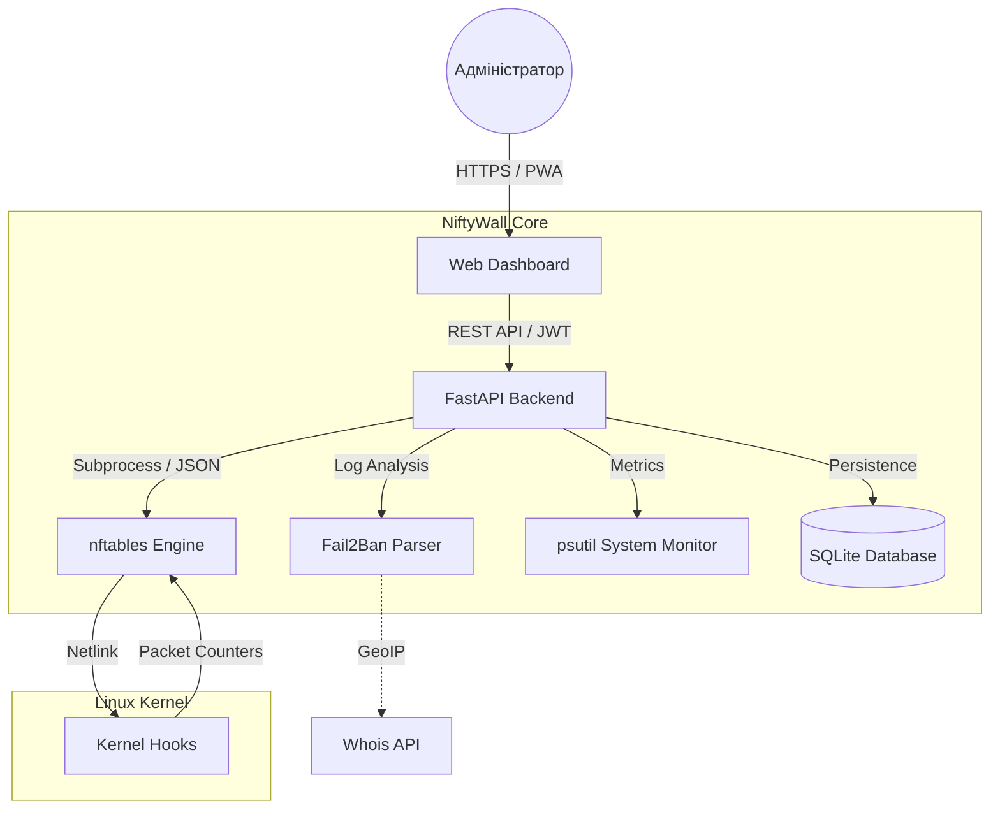

<p align="center">
  <a href="README_ENG.md">
    
  </a>
  <a href="README.md">
    
  </a>
</p>

<br>

<p align="center">
  
  
</p>

# 🛡️ NiftyWall v3.0.0 "Hardened" - Docker Edition [](https://github.com/weby-homelab/niftywall/releases/latest)

**NiftyWall** — це професійний веб-дашборд для керування фаєрволом. У версії v3.0.0 проект пройшов повний аудит та рефакторинг для досягнення Enterprise-стабільності та безпеки.

Ця гілка (`main`) містить **Docker Edition** проекту, оптимізовану для швидкого та ізольованого розгортання через Docker Compose.

---

## 🧩 Архітектура системи



---

## 🚀 Що нового у v3.0.0 "Hardened"

- **🔐 SQLite Backend:** Усі стани (користувачі, логи, історія) перенесені з JSON-файлів у надійну базу даних SQLite. Вирішено проблему Race Conditions.
- **🛡️ Strict Input Validation:** Впроваджено сувору валідацію всіх вхідних даних через Pydantic Regex. Повний захист від NFT-ін'єкцій.
- **🕰️ Isolated Time Machine:** Бекапи та відновлення тепер працюють виключно з таблицею `niftywall`. Система більше не зачіпає правила Docker чи VPN при відкаті.
- **🚨 Dynamic Panic Mode:** Можливість конфігурувати дозволені порти та інтерфейси через змінні середовища (`PANIC_ALLOWED_PORTS`).
- **🔄 Smart DNAT + SNAT:** Автоматичне додавання правил маскарадінгу (Masquerade) для усунення проблем асиметричної маршрутизації в NAT.
- **🕵️ Resilient Fail2Ban:** Нова логіка парсингу, яка не залежить від наявності лог-файлів та вміє запитувати статус напряму через `fail2ban-client`.

---

## 🛠️ Швидкий старт (Docker Edition)

Рекомендований спосіб для швидкого запуску в ізольованому середовищі.

```bash
# 1. Завантажте docker-compose.yml (опціонально) або просто запустіть образ
docker pull webyhomelab/niftywall:latest

# 2. Запустіть систему
docker run -d --name niftywall --privileged --network host \
  -v /var/log/fail2ban.log:/var/log/fail2ban.log:ro \
  -v /var/run/fail2ban:/var/run/fail2ban \
  -v /opt/niftywall/snapshots:/app/snapshots \
  -v /opt/niftywall/data:/app/data \
  -e SECRET_KEY=$(openssl rand -hex 32) \
  webyhomelab/niftywall:latest
```

*Примітка: `--privileged` та `--network host` необхідні для прямої взаємодії з nftables.*

---

## 📥 Інші варіанти встановлення

Для встановлення безпосередньо на хост-систему (Bare Metal) використовуйте гілку [classic](https://github.com/weby-homelab/niftywall/tree/classic).

---

## 📜 Історія оновлень
- **v3.0.0**: Реліз "Hardened". Повний рефакторинг, SQLite, безпека та ізольовані бекапи.
- **v2.0.1**: Hotfix верстки та сумісності DNAT-правил для `inet`.
- **v2.0.0**: Реліз "Autonomy". Повна ізоляція правил, сумісність з Docker без конфліктів.
- **v1.5.0**: Реліз "Smart Insights". Графіки, мобільний інтерфейс, Unban, Whois.

---

## 📋 Детальні Системні Вимоги та Сумісність (Environments)

Проект NiftyWall v2.0+ побудовано за принципом **абсолютної автономії**. Завдяки використанню ізольованої таблиці `inet niftywall` з найвищим пріоритетом ланцюгів (-100/-150), NiftyWall коректно працює у широкому спектрі середовищ.

### 🟢 1. Базові вимоги
- **ОС:** Ubuntu 24.04 (LTS), Debian 12 або сучасний Linux з ядром **6.8+**.
- **Ядро / Движок:** `nftables` версії **1.0.9** або новіше.
- **Доступ:** Права `root` (або `sudo`) для безпосереднього керування правилами ядра.

### 🟡 2. Змішане середовище (Сервери з Docker / LXC)
*Сервери, де активно використовується контейнеризація.*
- **Сумісність:** **Повна (Починаючи з v2.0).** NiftyWall більше не конфліктує з Docker.
- **Особливості:** Усі ваші правила з NiftyWall будуть застосовані до трафіку **раніше**, ніж він дійде до правил Docker (пріоритет -100). Це дозволяє безпечно блокувати трафік до його потрапляння в контейнери.

### 🔴 3. Вороже середовище (UFW або Firewalld)
*Сервери, де вже активний інший менеджер.*
- **Сумісність:** **Часткова / Не рекомендовано.**
- **Рішення:** NiftyWall створено як сучасну заміну для них. Якщо вам потрібен GUI саме для цих систем, використовуйте: [UFW-GUI](https://github.com/weby-homelab/ufw-gui) або [Firewalld-GUI](https://github.com/weby-homelab/firewalld-gui).

---
<p align="center">
  Made with ❤️ in Kyiv under air raid sirens and blackouts<br>
  <strong>✦ 2026 Weby Homelab ✦</strong>
</p>
