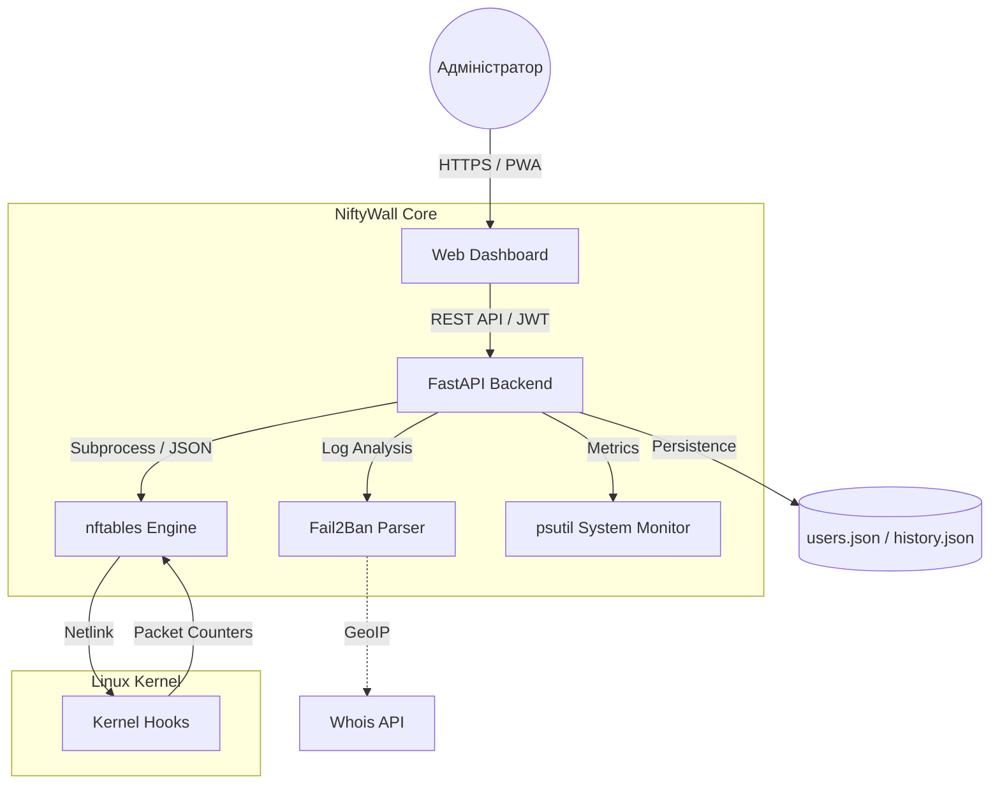

<p align="center">
  <a href="README_ENG.md">
    
  </a>
  <a href="README.md">
    
  </a>
</p>

# 🛡️ NiftyWall v2.0.1 "Autonomy"
*Making Linux Firewalls Transparent, Smart, and Beautiful.*

[](https://github.com/weby-homelab/niftywall)
[](LICENSE)
[]()

**NiftyWall** — це професійний веб-дашборд для керування `nftables`, створений для тих, хто цінує швидкість, естетику та повний контроль. На відміну від UFW чи Firewalld, NiftyWall не створює "свій світ" правил, а працює безпосередньо з ядром Linux, візуалізуючи реальний стан вашого фаєрвола.

---

## 🧩 Архітектура системи



---

## ✨ Нове у версії 1.5.0 (Smart Insights)

- **📈 Системна аналітика:** Живі графіки завантаження CPU та RAM, а також історія стабільності Uptime.
- **📱 Повна мобільна адаптивність:** Новий "картковий" інтерфейс для смартфонів та скрол-таби.
- **🚀 Easy Onboarding:** Миттєва реєстрація першого адміністратора при запуску.
- **🌍 Інтелектуальний Whois:** Детальна інформація про провайдера та країну будь-якої IP в один клік.
- **🛡️ Fail2Ban Pro:** Можливість розбанювати IP безпосередньо з дашборду.

## 🚀 Ключові переваги

- **Direct nftables Engine:** Робота з нативним JSON-форматом nftables. Жодних конфліктів із правилами Docker.
- **🕰️ Time Machine (Snapshots):** Автоматичне створення знімків конфігурації перед кожною зміною. Безпечний відкат в один клік.
- **📈 Activity Monitoring:** Спарклайни для кожного правила показують активність трафіку (pkts/sec) в реальному часі.
- **🚨 Panic Mode 2.0:** Миттєве блокування всього зайвого зі збереженням доступу до SSH та самого NiftyWall.
- **🔀 Smart NAT:** Легке керування прокиданням портів з автоматичним налаштуванням ланцюжків FORWARD.

---

## 🛠️ Встановлення на Bare Metal (Гілка Classic)

Ця версія (`classic`) оптимізована для роботи безпосередньо на хості (без Docker) за допомогою Systemd та Gunicorn.

```bash
# 1. Клонування репозиторію та перехід на гілку classic
git clone -b classic https://github.com/weby-homelab/niftywall.git /opt/niftywall
cd /opt/niftywall

# 2. Налаштування середовища
python3 -m venv venv && source venv/bin/activate
pip install -r requirements.txt

# 3. Налаштування конфігурації
cp .env.example .env
# Відредагуйте .env і додайте надійний SECRET_KEY
# SECRET_KEY=$(openssl rand -hex 32)

# 4. Встановлення та запуск сервісу
cp niftywall.service /etc/systemd/system/
systemctl daemon-reload
systemctl enable --now niftywall
```

---

## 📜 Історія оновлень
- **v2.0.0**: Реліз "Autonomy". Повна ізоляція правил, сумісність з Docker без конфліктів.
- **v1.5.2**: Stability hotfixes для Smart Insights.
- **v1.5.0**: Реліз "Smart Insights". Графіки, мобільний інтерфейс, Unban, Whois.

## 📋 Детальні Системні Вимоги та Сумісність (Environments)

Проект NiftyWall v2.0+ побудовано за принципом **абсолютної автономії**. Завдяки використанню ізольованої таблиці `inet niftywall` з найвищим пріоритетом ланцюгів (-100/-150), NiftyWall коректно працює у широкому спектрі середовищ.

### 🟢 1. Базові вимоги (Для всіх систем)
- **ОС:** Ubuntu 24.04 (LTS), Debian 12 або сучасний Linux з ядром **6.8+**.
- **Ядро / Движок:** `nftables` версії **1.0.9** або новіше.
- **Доступ:** Права `root` (або `sudo`) для безпосереднього керування правилами ядра.

### 🟢 2. Ідеальне середовище (Native Bare Metal / Cloud VPS)
*Сервери без жодних додаткових прошарків фаєрволів.*
- **Як працює:** NiftyWall є єдиним хазяїном мережевого трафіку.
- **Особливості:** Найвища швидкість обробки правил, 100% передбачуваність, ідеально для високозавантажених шлюзів, маршрутизаторів або VPN-серверів.

### 🟡 3. Змішане середовище (Сервери з Docker / LXC)
*Сервери, де активно використовується контейнеризація.*
- **Як працює:** Docker використовує підсистему `iptables-nft`, яка створює свої правила у системних таблицях (наприклад, `ip filter`, `ip nat`).
- **Сумісність:** **Повна (Починаючи з v2.0).** NiftyWall більше не конфліктує з Docker.
- **Особливості:** Усі ваші правила з NiftyWall будуть застосовані до трафіку **раніше**, ніж він дійде до правил Docker. Завдяки цьому ви можете безпечно блокувати (Drop) небажаний трафік ще до того, як він потрапить у відкриті порти ваших контейнерів.

### 🔴 4. Вороже середовище (UFW або Firewalld)
*Сервери, де вже активний інший високорівневий менеджер (наприклад, `ufw enable` чи `systemctl start firewalld`).*
- **Сумісність:** **Часткова / Не рекомендовано.**
- **Чому:** UFW створює десятки незрозумілих мікро-ланцюгів. Хоча правила NiftyWall (завдяки пріоритету) спрацюють першими, будь-який рестарт UFW може повністю переписати конфігурацію ядра і викликати непередбачувану поведінку. 
- **Рішення:** NiftyWall створено як **заміну** для UFW/Firewalld. Рекомендується вимкнути їх (`ufw disable` або `systemctl disable firewalld`) перед використанням NiftyWall.

---
<p align="center">
  Made with ❤️ in Kyiv under air raid sirens and blackouts<br>
  <strong>✦ 2026 Weby Homelab ✦</strong>
</p>
вання правилами.

---
<p align="center">
  Made with ❤️ in Kyiv under air raid sirens and blackouts<br>
  <strong>✦ 2026 Weby Homelab ✦</strong>
</p>
�� in Kyiv under air raid sirens and blackouts<br>
  <strong>✦ 2026 Weby Homelab ✦</strong>
</p>
