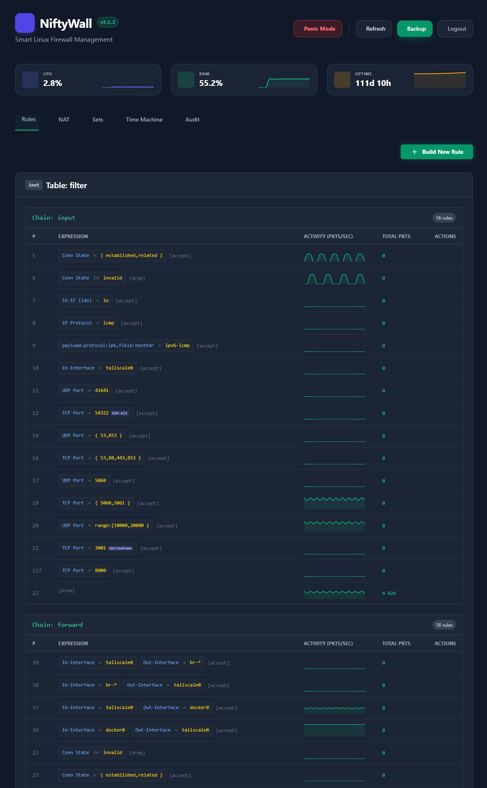
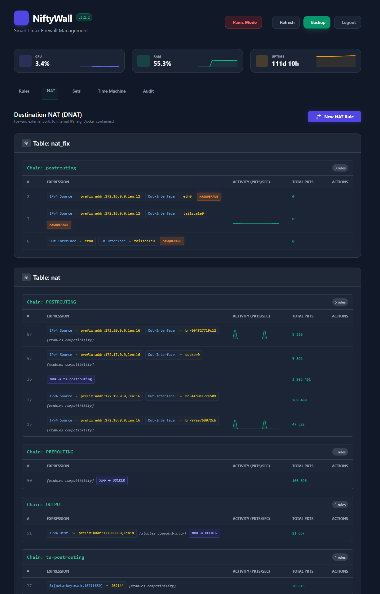
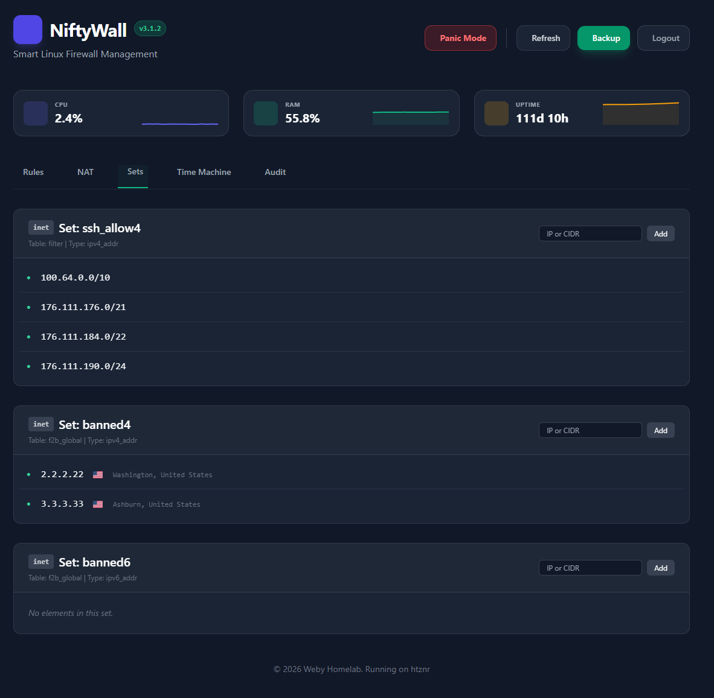
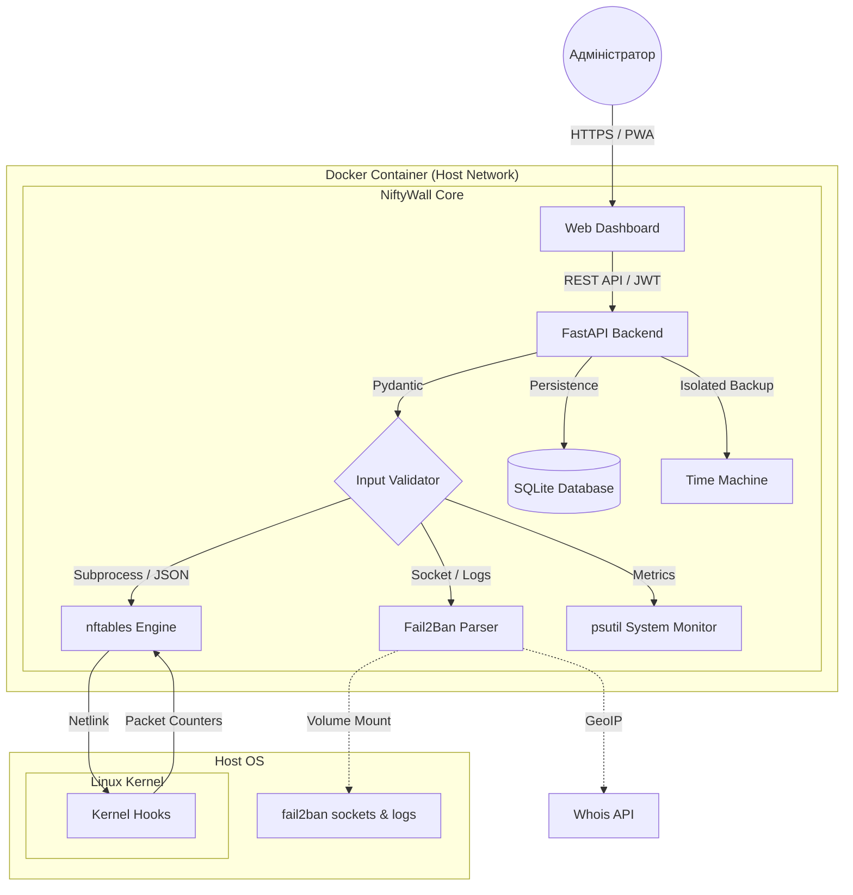

<p align="center">
  <a href="README_ENG.md">
    
  </a>
  <a href="README.md">
    
  </a>
</p>

<br>

<p align="center">
  
  
  
  
</p>

# 🛡️ NiftyWall "Hardened" - Docker Edition [](https://github.com/weby-homelab/niftywall/releases/latest)

*Making Linux Firewalls Transparent, Smart, and Beautiful.*

**NiftyWall** — це професійний веб-дашборд для керування фаєрволом nftables. У версії v3.0.0 проект пройшов повний аудит для досягнення Enterprise-стабільності та безпеки. Ця редакція (`main`) оптимізована для швидкого розгортання в ізольованому середовищі Docker.

---

## 📸 Інтерфейс

<p align="center">
  <br><br>
  <br><br>
  
</p>

---

## 🧩 Архітектура системи


---

## 🚀 Що нового у версії "Hardened"

- **🔐 SQLite Backend:** Усі стани (користувачі, логи, історія) перенесені в надійну БД SQLite. Вирішено проблему Race Conditions.
- **🛡️ Strict Input Validation:** Сувора валідація всіх вхідних даних через Pydantic. Повний захист від NFT-ін'єкцій.
- **🕰️ Isolated Time Machine:** Бекапи працюють виключно з таблицею `niftywall`, не зачіпаючи правила Docker чи VPN.
- **🔄 Smart DNAT + SNAT:** Автоматичне додавання правил маскарадінгу для усунення проблем асиметричної маршрутизації.
- **🕵️ Resilient Fail2Ban:** Нова логіка парсингу, що працює напряму через `fail2ban-client`.

---

## 🛠️ Встановлення (Docker Edition)

Цей метод забезпечує повну ізоляцію коду від хост-системи, використовуючи лише необхідні Kernel Hooks.

### 1. Попередні вимоги
- **Docker Engine** 24.0+ та **Docker Compose** v2.
- Наявність `nftables` у хост-системі (для завантаження модулів ядра).

### 2. Розгортання через Docker Compose
Створіть `docker-compose.yml`:

```yaml
services:
  niftywall:
    image: webyhomelab/niftywall:latest
    container_name: niftywall
    privileged: true # Необхідно для керування nftables
    network_mode: host # Необхідно для прямого доступу до інтерфейсів
    restart: always
    environment:
      - SECRET_KEY=${SECRET_KEY} # openssl rand -hex 32
      - PANIC_ALLOWED_PORTS=22,80,443,54322
      - TZ=Europe/Kyiv
    volumes:
      - /var/log/fail2ban.log:/var/log/fail2ban.log:ro
      - /var/run/fail2ban:/var/run/fail2ban
      - /opt/niftywall/data:/app/data
      - /opt/niftywall/snapshots:/app/snapshots
```

### 3. Запуск
```bash
docker compose up -d
```

---

## 📋 Детальні Системні Вимоги та Сумісність (Environments)

Проект NiftyWall побудовано за принципом **абсолютної автономії**. Завдяки використанню ізольованої таблиці `inet niftywall` з найвищим пріоритетом ланцюгів, система гарантує стабільність у складних мережевих середовищах.

### 🟢 1. Ідеальне середовище (Native Bare Metal / Cloud VPS)
*Сервери без додаткових прошарків сторонніх фаєрволів.*
- **Як працює:** NiftyWall є єдиним хазяїном мережевого трафіку. Він ініціалізує ланцюги `input` та `forward` з типом `filter` та пріоритетом **-100**, що дозволяє обробляти пакети на самому початку мережевого стеку ядра.
- **Особливості:** Найвища швидкість обробки правил, 100% передбачуваність та нульовий оверхед.

### 🟡 2. Змішане середовище (Сервери з Docker / LXC / KVM)
*Сервери, де активно використовується контейнеризація.*
- **Сумісність:** **Повна (v2.0+).** NiftyWall більше не конфліктує з Docker.
- **Концепція "Shield-First":** Завдяки пріоритету **-100**, правила NiftyWall спрацьовують **РАНІШЕ**, ніж правила Docker (які зазвичай мають пріоритет 0). Це дозволяє вам заблокувати загрозу на рівні ядра до того, як вона взагалі потрапить у віртуальні мости контейнерів.
- **Ізоляція:** Робота у власному просторі імен (`table inet niftywall`) виключає випадкове видалення правил Docker при скиданні конфігурації.

### 🔴 3. Вороже середовище (UFW або Firewalld)
*Сервери, де вже активний інший високорівневий менеджер.*
- **Сумісність:** **Не рекомендовано.**
- **Проблема "Затінення":** `nftables` дозволяє паралельну роботу кількох таблиць. Пакет має бути дозволений **в обох** системах одночасно. Якщо NiftyWall дозволяє трафік, а забутий UFW його блокує — ви отримаєте важку в діагностиці проблему.
- **Рішення:** Рекомендується виконати `systemctl disable --now ufw` або `firewalld` перед використанням NiftyWall. Якщо вам потрібен GUI саме для них, використовуйте: [UFW-GUI](https://github.com/weby-homelab/ufw-gui) або [Firewalld-GUI](https://github.com/weby-homelab/firewalld-gui).

---

<br>
<p align="center">
  Built in Ukraine under air raid sirens &amp; blackouts ⚡<br>
  &copy; 2026 Weby Homelab
</p>
