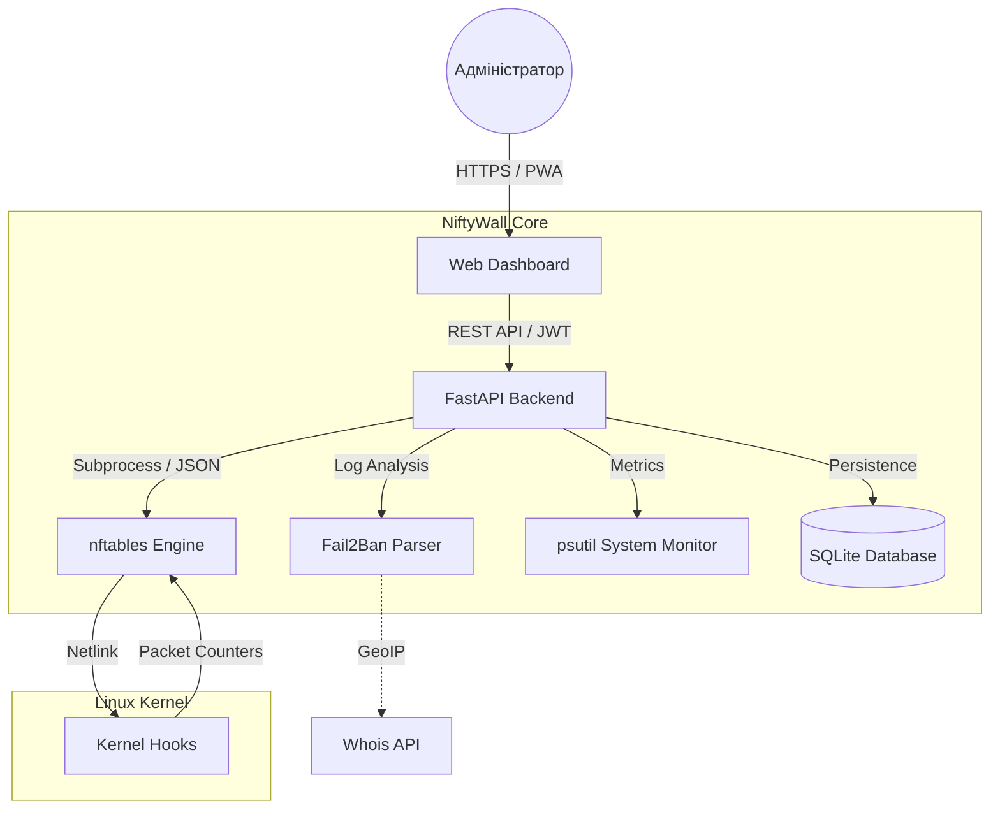

<p align="center">
  <a href="README_ENG.md">
    
  </a>
  <a href="README.md">
    
  </a>
</p>

<br>

<p align="center">
  
  
  
  
</p>

# 🛡️ NiftyWall v3.0.0 "Hardened" - Docker Edition [](https://github.com/weby-homelab/niftywall/releases/latest)

*Making Linux Firewalls Transparent, Smart, and Beautiful.*

**NiftyWall** — це професійний веб-дашборд для керування фаєрволом. У версії v3.0.0 проект пройшов повний аудит та рефакторинг для досягнення Enterprise-стабільності та безпеки.

Ця гілка (`main`) містить **Docker Edition** проекту, оптимізовану для швидкого та ізольованого розгортання через Docker Compose.

---

## 🧩 Архітектура системи



---

## 🚀 Що нового у v3.0.0 "Hardened"

- **🔐 SQLite Backend:** Усі стани (користувачі, логи, історія) перенесені з JSON-файлів у надійну базу даних SQLite. Вирішено проблему Race Conditions.
- **🛡️ Strict Input Validation:** Впроваджено сувору валідацію всіх вхідних даних через Pydantic Regex. Повний захист від NFT-ін'єкцій.
- **🕰️ Isolated Time Machine:** Бекапи та відновлення тепер працюють виключно з таблицею `niftywall`. Система більше не зачіпає правила Docker чи VPN при відкаті.
- **🚨 Dynamic Panic Mode:** Можливість конфігурувати дозволені порти та інтерфейси через змінні середовища (`PANIC_ALLOWED_PORTS`).
- **🔄 Smart DNAT + SNAT:** Автоматичне додавання правил маскарадінгу (Masquerade) для усунення проблем асиметричної маршрутизації в NAT.
- **🕵️ Resilient Fail2Ban:** Нова логіка парсингу, яка не залежить від наявності лог-файлів та вміє запитувати статус напряму через `fail2ban-client`.

---

## 🛠️ Швидкий старт (Docker Edition)

### 📦 Попередні вимоги
- **Docker Engine** 24.0+ та **Docker Compose** v2.
- Встановлений пакет `nftables` на хост-системі.
- Права `root` для доступу до Kernel Hooks.

### 🚀 Запуск системи
Рекомендований спосіб через `docker-compose.yml`:

```yaml
services:
  niftywall:
    image: webyhomelab/niftywall:latest
    container_name: niftywall
    privileged: true
    network_mode: host
    restart: always
    environment:
      - SECRET_KEY=YOUR_SUPER_SECRET_KEY
      - TZ=Europe/Kyiv
    volumes:
      - /var/log/fail2ban.log:/var/log/fail2ban.log:ro
      - /var/run/fail2ban:/var/run/fail2ban
      - /opt/niftywall/snapshots:/app/snapshots
      - /opt/niftywall/data:/app/data
```

```bash
# Запуск однією командою
docker compose up -d
```

### ⚙️ Змінні середовища (.env)

| Змінна | Опис | Значення за замовчуванням |
| :--- | :--- | :--- |
| `SECRET_KEY` | Ключ для шифрування JWT токенів | *Обов'язково згенерувати* |
| `PANIC_ALLOWED_PORTS` | Порти, що залишаються відкритими у Panic Mode | `22,80,443,54322` |
| `LOG_LEVEL` | Рівень логування (info, debug, warning) | `info` |
| `DB_PATH` | Шлях до файлу SQLite всередині контейнера | `/app/data/niftywall.db` |

---

## 📋 Детальні Системні Вимоги та Сумісність (Environments)

Проект NiftyWall v2.0+ побудовано за принципом **абсолютної автономії**. Завдяки використанню ізольованої таблиці `inet niftywall` з найвищим пріоритетом ланцюгів, NiftyWall коректно працює у широкому спектрі середовищ.

### 🟢 1. Ідеальне середовище (Native Bare Metal / Cloud VPS)
*Прозоре керування ядром без посередників.*
- **Механіка:** NiftyWall ініціалізує таблицю `inet niftywall` у стеку `nftables`. Використовується тип `filter` для ланцюгів `input` та `forward` з пріоритетом **-100**, що дозволяє обробляти пакети на ранніх етапах мережевого стеку.
- **Особливості:** Найвища швидкість обробки правил та 100% передбачуваність. Жодне правило не буде проігнороване сторонніми сервісами.

### 🟡 2. Змішане середовище (Сервери з Docker / LXC / KVM)
*Гармонійне співіснування з контейнеризацією.*
- **Концепція "Shield-First":** Завдяки пріоритету **-100**, NiftyWall стає "першим ешелоном" оборони. Пакети потрапляють у ваші правила **до** того, як вони будуть спрямовані в ланцюги `DOCKER-USER` або `FORWARD` пакетного менеджера Docker.
- **Ізоляція таблиць:** Робота у власному просторі імен (`table inet niftywall`) виключає ризик випадкового видалення правил Docker при оновленні конфігурації.
- **Сумісність з NAT:** Коректно обробляє `masquerade` для зовнішніх інтерфейсів, не зачіпаючи внутрішні мережеві мости `docker0` або `br-*`.

### 🔴 3. Вороже середовище (UFW або Firewalld)
*Ризик конфліктів та "затінення" правил.*
- **Проблема:** Оскільки `nftables` дозволяє паралельну роботу кількох таблиць, пакет має бути дозволений **в обох** системах одночасно. Це створює ситуації, коли NiftyWall дозволяє трафік, але застарілий менеджер його блокує "в тіні".
- **Рішення:** Для усунення Race Conditions ми наполегливо рекомендуємо виконати `systemctl disable --now ufw` або `firewalld` перед активацією NiftyWall. Якщо вам потрібен GUI саме для цих систем, використовуйте: [UFW-GUI](https://github.com/weby-homelab/ufw-gui) або [Firewalld-GUI](https://github.com/weby-homelab/firewalld-gui).

---
<p align="center">
  Made with ❤️ in Kyiv under air raid sirens and blackouts<br>
  <strong>✦ 2026 Weby Homelab ✦</strong>
</p>