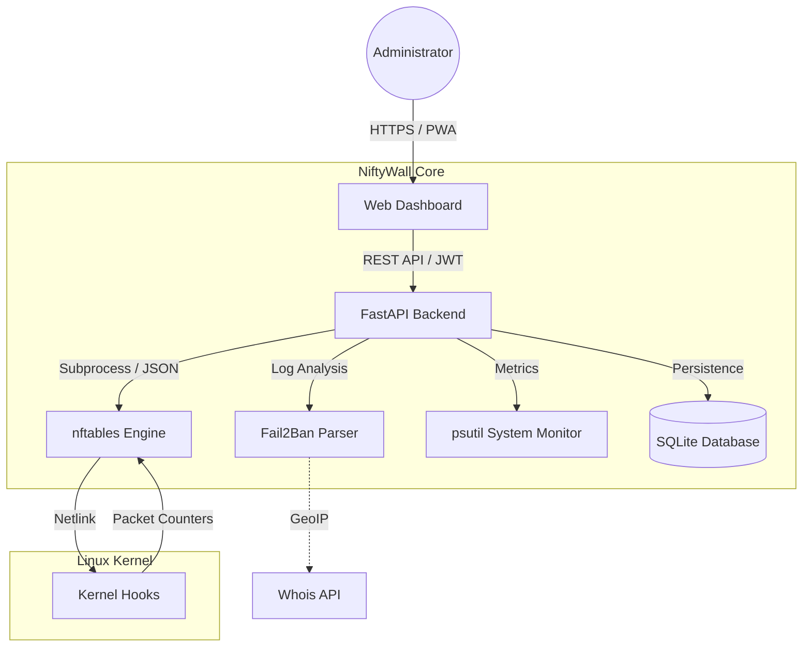

<p align="center">
  <a href="README_ENG.md">
    
  </a>
  <a href="README.md">
    
  </a>
</p>

<br>

<p align="center">
  
  
  
  
</p>

# 🛡️ NiftyWall v3.0.0 "Hardened" - Docker Edition [](https://github.com/weby-homelab/niftywall/releases/latest)

*Making Linux Firewalls Transparent, Smart, and Beautiful.*

**NiftyWall** is a professional web dashboard for firewall management. In the v3.0.0 update, the project underwent a full audit and refactoring to achieve Enterprise-grade stability and security.

This branch (`main`) contains the **Docker Edition** of the project, optimized for quick and isolated deployments via Docker Compose.

---

## 🧩 System Architecture



---

## 🚀 What's New in v3.0.0 "Hardened"

- **🔐 SQLite Backend:** All states (users, logs, history) migrated from JSON files to a reliable SQLite database. Resolved Race Conditions.
- **🛡️ Strict Input Validation:** Implemented rigorous input validation via Pydantic Regex. Full protection against NFT injections.
- **🕰️ Isolated Time Machine:** Backup and Restore now work exclusively with the `niftywall` table. The system no longer affects Docker or VPN rules during rollback.
- **🚨 Dynamic Panic Mode:** Configure allowed ports and interfaces via environment variables (`PANIC_ALLOWED_PORTS`).
- **🔄 Smart DNAT + SNAT:** Automatic addition of Masquerade rules to eliminate asymmetric routing issues in NAT.
- **🕵️ Resilient Fail2Ban:** New parsing logic independent of log files, capable of querying status directly via `fail2ban-client`.

---

## 🛠️ Quick Start (Docker Edition)

### 📦 Prerequisites
- **Docker Engine** 24.0+ and **Docker Compose** v2.
- `nftables` package installed on the host system.
- `root` privileges to access Kernel Hooks.

### 🚀 Launching the System
Recommended way using `docker-compose.yml`:

```yaml
services:
  niftywall:
    image: webyhomelab/niftywall:latest
    container_name: niftywall
    privileged: true
    network_mode: host
    restart: always
    environment:
      - SECRET_KEY=YOUR_SUPER_SECRET_KEY
      - TZ=Europe/Kyiv
    volumes:
      - /var/log/fail2ban.log:/var/log/fail2ban.log:ro
      - /var/run/fail2ban:/var/run/fail2ban
      - /opt/niftywall/snapshots:/app/snapshots
      - /opt/niftywall/data:/app/data
```

```bash
# Run with a single command
docker compose up -d
```

### ⚙️ Environment Variables (.env)

| Variable | Description | Default Value |
| :--- | :--- | :--- |
| `SECRET_KEY` | Key for JWT token encryption | *Must be generated* |
| `PANIC_ALLOWED_PORTS` | Ports that remain open in Panic Mode | `22,80,443,54322` |
| `LOG_LEVEL` | Logging level (info, debug, warning) | `info` |
| `DB_PATH` | Path to the SQLite file inside the container | `/app/data/niftywall.db` |

---

## 📋 Detailed System Requirements and Environments

NiftyWall v2.0+ is built on the principle of **absolute autonomy**. By utilizing an isolated `inet niftywall` table with high-priority chains, NiftyWall functions correctly across a wide range of environments.

### 🟢 1. Ideal Environment (Native Bare Metal / Cloud VPS)
*Transparent kernel management without intermediaries.*
- **Mechanics:** NiftyWall initializes an `inet niftywall` table in the `nftables` stack. It uses `filter` type for `input` and `forward` chains with **priority -100**, allowing packet processing at early stages of the network stack.
- **Features:** Highest rule processing speed and 100% predictability. No rule will be ignored by third-party services.

### 🟡 2. Mixed Environment (Servers with Docker / LXC / KVM)
*Harmonious coexistence with containerization.*
- **"Shield-First" Concept:** Thanks to **priority -100**, NiftyWall becomes the "first line of defense." Packets hit your rules **before** they are routed to the `DOCKER-USER` or `FORWARD` chains of the Docker package manager.
- **Table Isolation:** Operating in its own namespace (`table inet niftywall`) eliminates the risk of accidentally deleting Docker rules during configuration updates.
- **NAT Compatibility:** Correctly handles `masquerade` for external interfaces without affecting internal `docker0` or `br-*` network bridges.

### 🔴 3. Hostile Environment (UFW or Firewalld active)
*Risk of conflicts and rule "shadowing".*
- **The Problem:** Since `nftables` allows multiple tables to work in parallel, a packet must be allowed in **both** systems simultaneously. This creates situations where NiftyWall allows traffic, but a legacy manager blocks it "in the shadow."
- **Solution:** To eliminate Race Conditions, we strongly recommend executing `systemctl disable --now ufw` or `firewalld` before activating NiftyWall. If you specifically need a GUI for these legacy systems, use: [UFW-GUI](https://github.com/weby-homelab/ufw-gui) or [Firewalld-GUI](https://github.com/weby-homelab/firewalld-gui).

---
<p align="center">
  Made with ❤️ in Kyiv under air raid sirens and blackouts<br>
  <strong>✦ 2026 Weby Homelab ✦</strong>
</p>