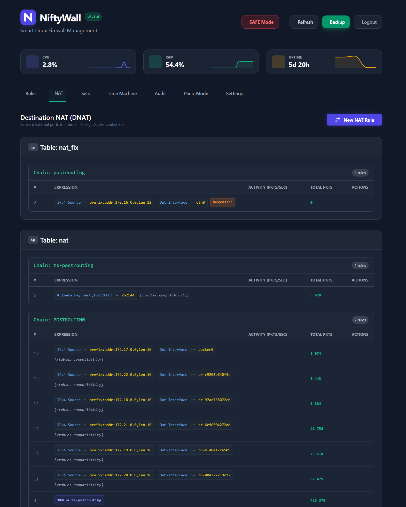
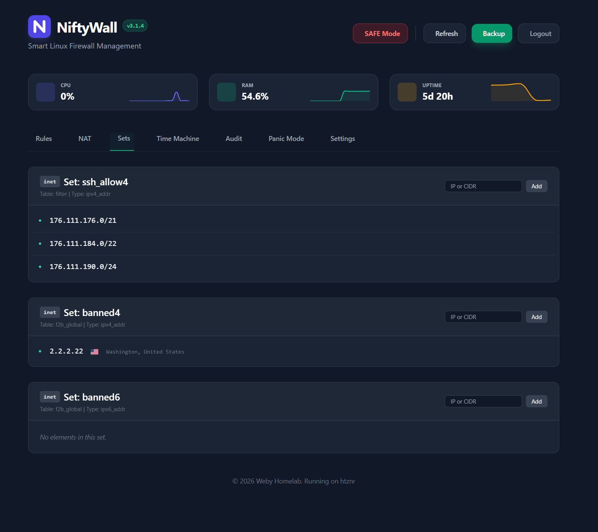
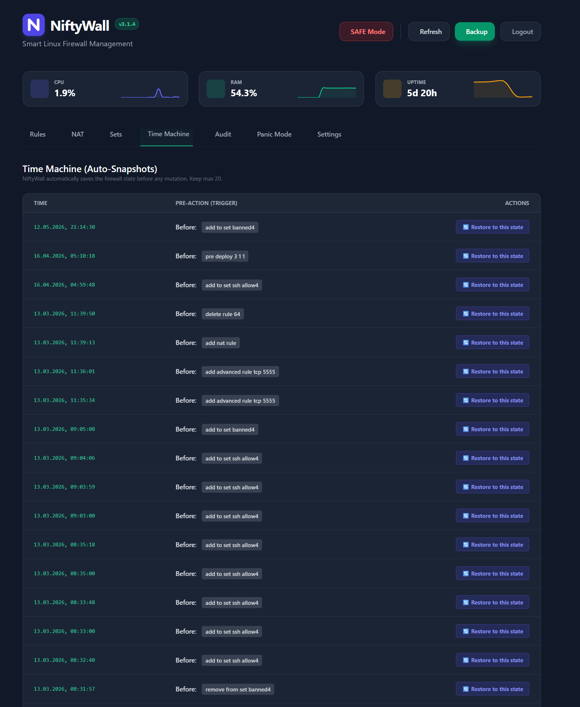
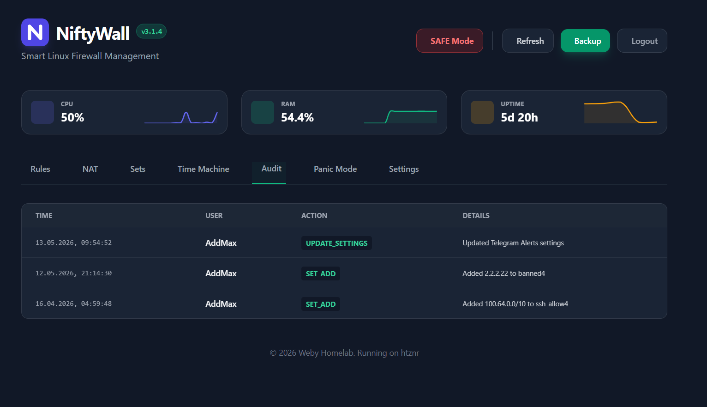
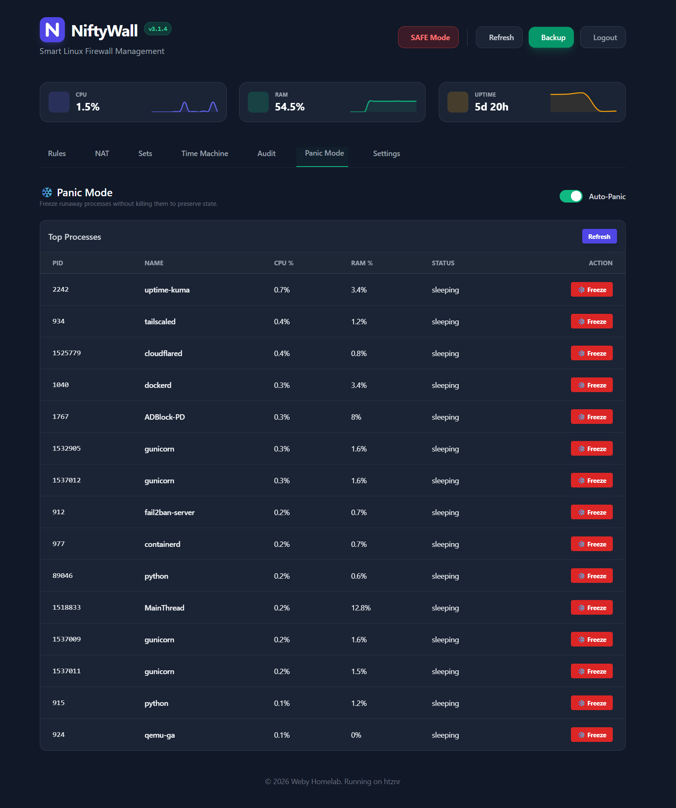
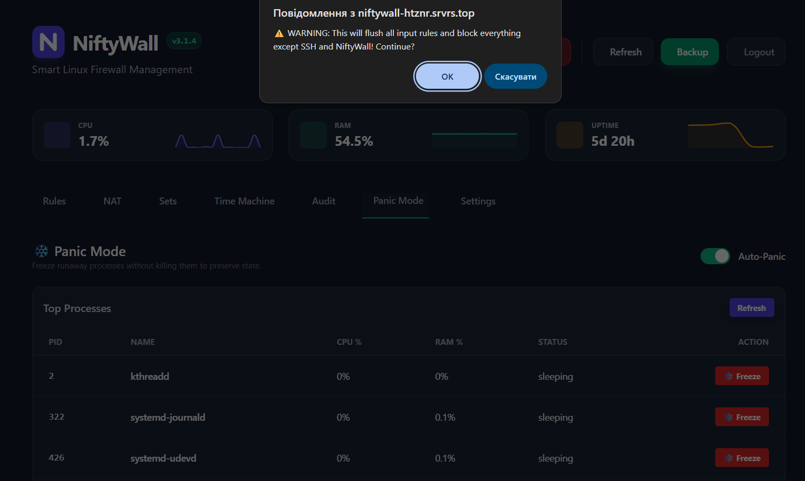
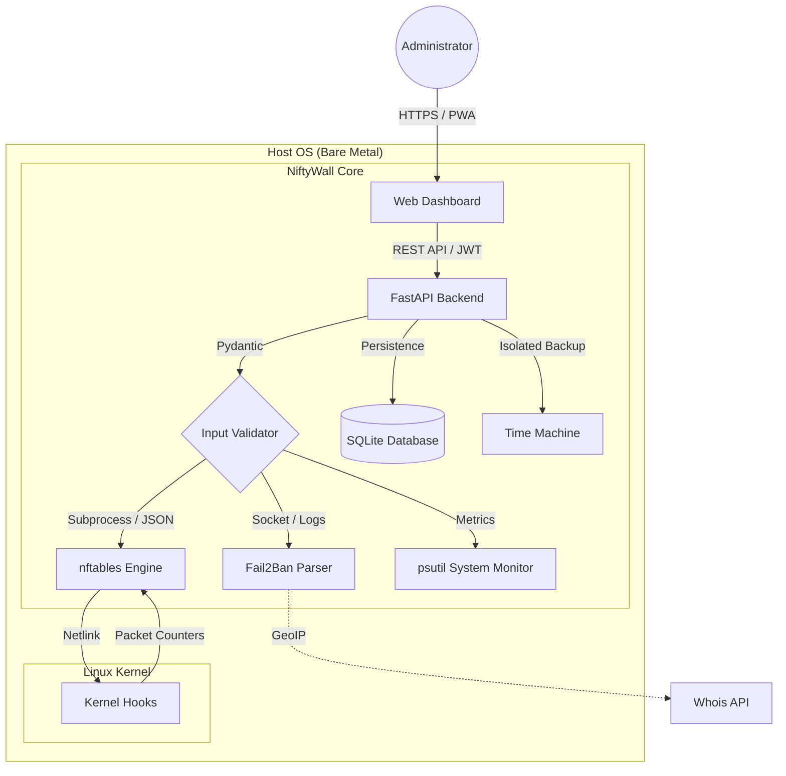

<p align="center">
  <a href="README_ENG.md">
    
  </a>
  <a href="README.md">
    
  </a>
</p>

<br>

<p align="center">
  
  
  
  
</p>

# 🛡️ NiftyWall "Hardened" - Bare Metal Edition [](https://github.com/weby-homelab/niftywall/releases/latest)

*Making Linux Firewalls Transparent, Smart, and Beautiful.*

**NiftyWall** is a professional web dashboard for managing the nftables firewall. In the v3.2.0 update, the project underwent a full audit to achieve Enterprise-grade stability and security. This edition (`classic`) is optimized for direct execution on the host system, providing maximum performance and direct access to the kernel's Netlink API.

---

## 📸 Screenshots

<p align="center">
  <br><br>
  <br><br>
  <br><br>
  <br><br>
  <br><br>
  
</p>

---

## ❄️ Panic Mode & SAFE Mode

- **🛡️ SAFE Mode (Emergency Lockdown):** Your digital "emergency brake" for the server. The **SAFE Mode** button activates a lockdown state:
    1.  **Instant Snapshot**: Automatically creates a backup of all current firewall rules.
    2.  **Sterilization**: Flushes the `niftywall` table completely — all unauthorized active connections are dropped.
    3.  **Whitelisting**: Applies a minimal configuration allowing traffic only for critical services: SSH (22, 54322), NiftyWall (8080), and trusted interfaces (Tailscale, Loopback).
    4.  **Isolation**: All public services (HTTP, DB, etc.) become unreachable until you exit the mode.
- **❄️ Panic Mode (Process Freezing):** Intelligent resource monitoring. If the system detects abnormal CPU or RAM usage, you can freeze (`SIGSTOP`) malicious processes with a single click. Frozen processes are automatically pinned to the top of the monitor, releasing resources without a full `kill`, preserving their state for analysis.

> **Note:** SAFE Mode manages the **network**, while Panic Mode manages **resources (processes)**.

---

## 🧩 System Architecture


---

## 🚀 What's New in "Hardened"

- **🔐 SQLite Backend:** All states migrated to a reliable SQLite database. Resolved Race Conditions.
- **🛡️ Strict Input Validation:** Rigorous input validation via Pydantic. Full protection against NFT injections.
- **🕰️ Isolated Time Machine:** Backup and Restore work exclusively with the `niftywall` table, without affecting Docker or VPN rules.
- **🔄 Smart DNAT + SNAT:** Automatic addition of Masquerade rules to eliminate asymmetric routing issues.
- **🕵️ Resilient Fail2Ban:** New parsing logic capable of querying status directly via `fail2ban-client`.

---

## 🛠️ Installation (Bare Metal Edition)

Optimized for operation using Systemd and Uvicorn on pure Linux.

### 1. Prerequisites
- **Python** 3.10+
- **nftables** package (v1.0.9+)
- **fail2ban** package (for log analysis)
- **root** or **sudo** privileges

### 2. Step-by-Step Launch
```bash
# Clone the repository
git clone -b classic https://github.com/weby-homelab/niftywall.git /opt/niftywall
cd /opt/niftywall

# Python setup
python3 -m venv venv
source venv/bin/activate
pip install -r requirements.txt

# Environment setup
cp .env.example .env
# Generate SECRET_KEY: openssl rand -hex 32
```

### 3. Systemd Configuration
Create `/etc/systemd/system/niftywall.service`:
```ini
[Unit]
Description=NiftyWall Firewall Dashboard
After=network.target nftables.service

[Service]
User=root
WorkingDirectory=/opt/niftywall
ExecStart=/opt/niftywall/venv/bin/uvicorn app.main:app --host 0.0.0.0 --port 8000
Restart=always

[Install]
WantedBy=multi-user.target
```
```bash
systemctl daemon-reload
systemctl enable --now niftywall
```

---

## 📋 Detailed System Requirements and Compatibility (Environments)

### 🟢 1. Ideal Environment (Native Bare Metal / Cloud VPS)
*Transparent kernel management without intermediaries.*
- **How it works:** NiftyWall initializes the `inet niftywall` table in the `nftables` stack. It uses the `filter` type for the `input` and `forward` chains with a priority of **-100**, allowing packet processing at the early stages of the network stack.
- **Features:** Highest rule processing speed and 100% predictability. No rule will be ignored by third-party services.

### 🟡 2. Mixed Environment (Servers with Docker / LXC / KVM)
*Harmonious coexistence with containerization.*
- **"Shield-First" Concept:** Due to the **-100** priority, NiftyWall becomes the "first line" of defense. Packets hit your rules **BEFORE** they are directed to the `DOCKER-USER` or `FORWARD` chains of the Docker package manager.
- **Table Isolation:** Working in its own namespace (`table inet niftywall`) eliminates the risk of accidentally deleting Docker rules when updating the configuration.

### 🔴 3. Hostile Environment (UFW or Firewalld)
*Risk of conflicts and "shadowing" of rules.*
- **Problem:** Since `nftables` allows the parallel operation of several tables, a packet must be allowed **in both** systems simultaneously. This creates situations where NiftyWall allows traffic, but the legacy manager blocks it "in the shadow".
- **Solution:** It is recommended to run `systemctl disable --now ufw` or `firewalld` before activating NiftyWall. If you need a GUI specifically for them, use: [UFW-GUI](https://github.com/weby-homelab/ufw-gui) or [Firewalld-GUI](https://github.com/weby-homelab/firewalld-gui).

---

## 📋 Other options
For rapid deployment in an isolated environment, use the [main](https://github.com/weby-homelab/niftywall/tree/main) branch (Docker Edition).

---

<br>
<p align="center">
  Built in Ukraine under air raid sirens &amp; blackouts ⚡<br>
  &copy; 2026 Weby Homelab
</p>
