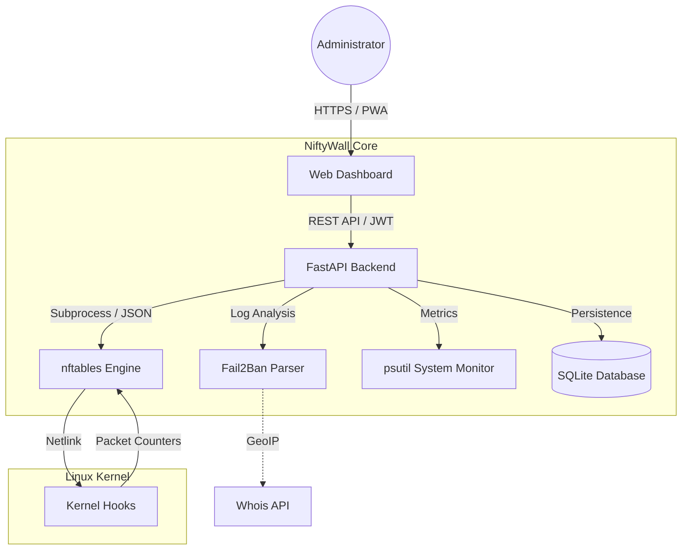

<p align="center">
  <a href="README_ENG.md">
    
  </a>
  <a href="README.md">
    
  </a>
</p>

<br>

<p align="center">
  
  
  
  
</p>

# 🛡️ NiftyWall v3.0.0 "Hardened" - Docker Edition [](https://github.com/weby-homelab/niftywall/releases/latest)

*Making Linux Firewalls Transparent, Smart, and Beautiful.*

**NiftyWall** is a professional web dashboard for managing the nftables firewall. In the v3.0.0 update, the project underwent a full audit to achieve Enterprise-grade stability and security. This edition (`main`) is optimized for rapid deployment in an isolated Docker environment.

---

## 🧩 System Architecture



---

## 🚀 What's New in v3.0.0 "Hardened"

- **🔐 SQLite Backend:** All states (users, logs, history) migrated to a reliable SQLite database. Resolved Race Conditions.
- **🛡️ Strict Input Validation:** Rigorous input validation via Pydantic. Full protection against NFT injections.
- **🕰️ Isolated Time Machine:** Backup and Restore work exclusively with the `niftywall` table, without affecting Docker or VPN rules.
- **🔄 Smart DNAT + SNAT:** Automatic addition of Masquerade rules to eliminate asymmetric routing issues.
- **🕵️ Resilient Fail2Ban:** New parsing logic capable of querying status directly via `fail2ban-client`.

---

## 🛠️ Installation (Docker Edition)

This method ensures full code isolation from the host system while utilizing necessary Kernel Hooks.

### 1. Prerequisites
- **Docker Engine** 24.0+ and **Docker Compose** v2.
- `nftables` present on the host system (for kernel module loading).

### 2. Deployment via Docker Compose
Create `docker-compose.yml`:

```yaml
services:
  niftywall:
    image: webyhomelab/niftywall:latest
    container_name: niftywall
    privileged: true # Required for nftables management
    network_mode: host # Required for direct interface access
    restart: always
    environment:
      - SECRET_KEY=${SECRET_KEY} # openssl rand -hex 32
      - PANIC_ALLOWED_PORTS=22,80,443,54322
      - TZ=Europe/Kyiv
    volumes:
      - /var/log/fail2ban.log:/var/log/fail2ban.log:ro
      - /var/run/fail2ban:/var/run/fail2ban
      - /opt/niftywall/data:/app/data
      - /opt/niftywall/snapshots:/app/snapshots
```

### 3. Run
```bash
docker compose up -d
```

---

## 📋 Compatibility and Environments

### 🟢 Mixed Environment (Docker / LXC / KVM)
NiftyWall initializes the `inet niftywall` table with **priority -100**. This means your rules trigger **BEFORE** traffic hits Docker's chains. You can safely block threats at the entry point without breaking the container network.

### 🔴 Hostile Environment (UFW / Firewalld)
You must execute `systemctl disable --now ufw`, as the parallel operation of two managers leads to rule "shadowing" (a packet must be allowed in both tables simultaneously).

---

## 📥 Other Options
For maximum performance on VPS with limited resources (RAM < 512MB), use the [classic](https://github.com/weby-homelab/niftywall/tree/classic) branch.

---
<p align="center">
  Made with ❤️ in Kyiv under air raid sirens and blackouts<br>
  <strong>✦ 2026 Weby Homelab ✦</strong>
</p>
