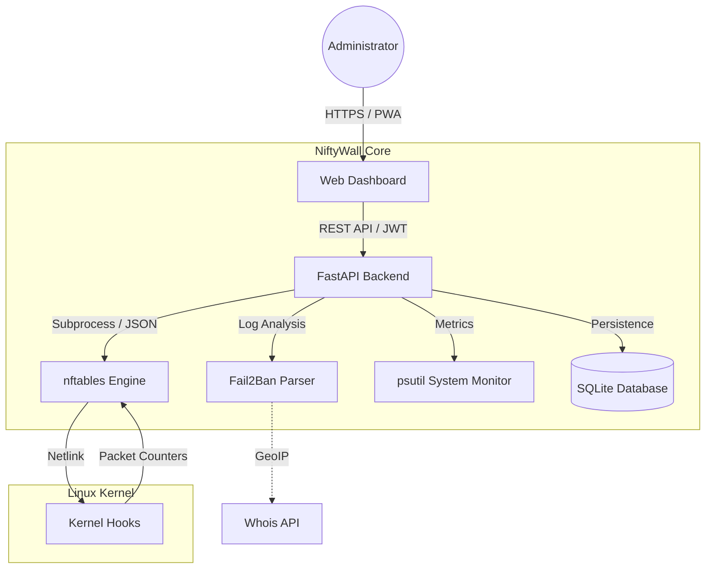

<p align="center">
  <a href="README_ENG.md">
    
  </a>
  <a href="README.md">
    
  </a>
</p>

# 🛡️ NiftyWall v3.0.0 "Hardened"
*Making Linux Firewalls Transparent, Smart, and Beautiful.*

[](https://github.com/weby-homelab/niftywall)
[](LICENSE)
[]()

**NiftyWall** is a professional web dashboard for firewall management. In the v3.0.0 update, the project underwent a full audit and refactoring to achieve Enterprise-grade stability and security.

---

## 🧩 System Architecture



---

## 🚀 What's New in v3.0.0 "Hardened"

- **🔐 SQLite Backend:** All states (users, logs, history) migrated from JSON files to a reliable SQLite database. Resolved Race Conditions.
- **🛡️ Strict Input Validation:** Implemented rigorous input validation via Pydantic Regex. Full protection against NFT injections.
- **🕰️ Isolated Time Machine:** Backup and Restore now work exclusively with the `niftywall` table. The system no longer affects Docker or VPN rules during rollback.
- **🚨 Dynamic Panic Mode:** Configure allowed ports and interfaces via environment variables (`PANIC_ALLOWED_PORTS`).
- **🔄 Smart DNAT + SNAT:** Automatic addition of Masquerade rules to eliminate asymmetric routing issues in NAT.
- **🕵️ Resilient Fail2Ban:** New parsing logic independent of log files, capable of querying status directly via `fail2ban-client`.

---

## 🛠️ Bare Metal Installation (Classic Branch)

This version (`classic`) is optimized to run directly on the host (without Docker) using Systemd and Gunicorn.

```bash
# 1. Clone repository and switch to classic branch
git clone -b classic https://github.com/weby-homelab/niftywall.git /opt/niftywall
cd /opt/niftywall

# 2. Setup environment
python3 -m venv venv && source venv/bin/activate
pip install -r requirements.txt

# 3. Setup configuration
cp .env.example .env
# Edit .env and add a secure SECRET_KEY
# SECRET_KEY=$(openssl rand -hex 32)

# 4. Install and start service
cp niftywall.service /etc/systemd/system/
systemctl daemon-reload
systemctl enable --now niftywall
```

---

## 📜 Update History
- **v3.0.0**: "Hardened" release. Full refactor, SQLite, security, and isolated backups.
- **v2.0.1**: Hotfix for UI layout and DNAT rule disambiguation in `inet` tables.
- **v2.0.0**: "Autonomy" release. Full rule isolation, seamless Docker compatibility without conflicts.
- **v1.5.0**: "Smart Insights" release. Charts, mobile UI, Unban, Whois.

## 📋 Detailed System Requirements and Environments

NiftyWall v2.0+ is built on the principle of **absolute autonomy**. By utilizing an isolated `inet niftywall` table with the highest chain priority (-100/-150), NiftyWall functions correctly across a wide range of environments.

### 🟢 1. Base Requirements (For all systems)
- **OS:** Ubuntu 24.04 (LTS), Debian 12, or any modern Linux with Kernel **6.8+**.
- **Engine:** `nftables` version **1.0.9** or newer.
- **Access:** `root` privileges (or `sudo`) for direct kernel rule management.

### 🟢 2. Ideal Environment (Native Bare Metal / Cloud VPS)
*Servers running without any additional firewall wrappers.*
- **How it works:** NiftyWall is the sole master of your network traffic.
- **Characteristics:** Highest rule processing speed, 100% predictability, perfect for high-load gateways, routers, or VPN servers.

### 🟡 3. Mixed Environment (Servers with Docker / LXC)
*Servers actively utilizing containerization.*
- **How it works:** Docker traditionally uses the `iptables-nft` subsystem, generating its own rules in system tables (e.g., `ip filter`, `ip nat`).
- **Compatibility:** **Full (As of v2.0).** NiftyWall no longer conflicts with Docker.
- **Characteristics:** All your NiftyWall rules will be applied to the traffic **before** it ever reaches Docker's rules. This allows you to safely block (Drop) malicious traffic before it hits the exposed ports of your containers.

### 🔴 4. Hostile Environment (UFW or Firewalld active)
*Servers where another high-level manager is already running (e.g., `ufw enable` or `systemctl start firewalld`).*
- **Compatibility:** **Partial / Not Recommended.**
- **Why:** UFW and Firewalld create dozens of opaque micro-chains. While NiftyWall rules trigger first, any restart of these services may cause conflicts.
- **Solution:** NiftyWall is designed as a modern replacement. If you specifically need a GUI for these legacy systems, use our dedicated projects: [UFW-GUI](https://github.com/weby-homelab/ufw-gui) or [Firewalld-GUI](https://github.com/weby-homelab/firewalld-gui). Otherwise, it is highly recommended to disable them before adopting NiftyWall.

---
<p align="center">
  Made with ❤️ in Kyiv under air raid sirens and blackouts<br>
  <strong>✦ 2026 Weby Homelab ✦</strong>
</p>
