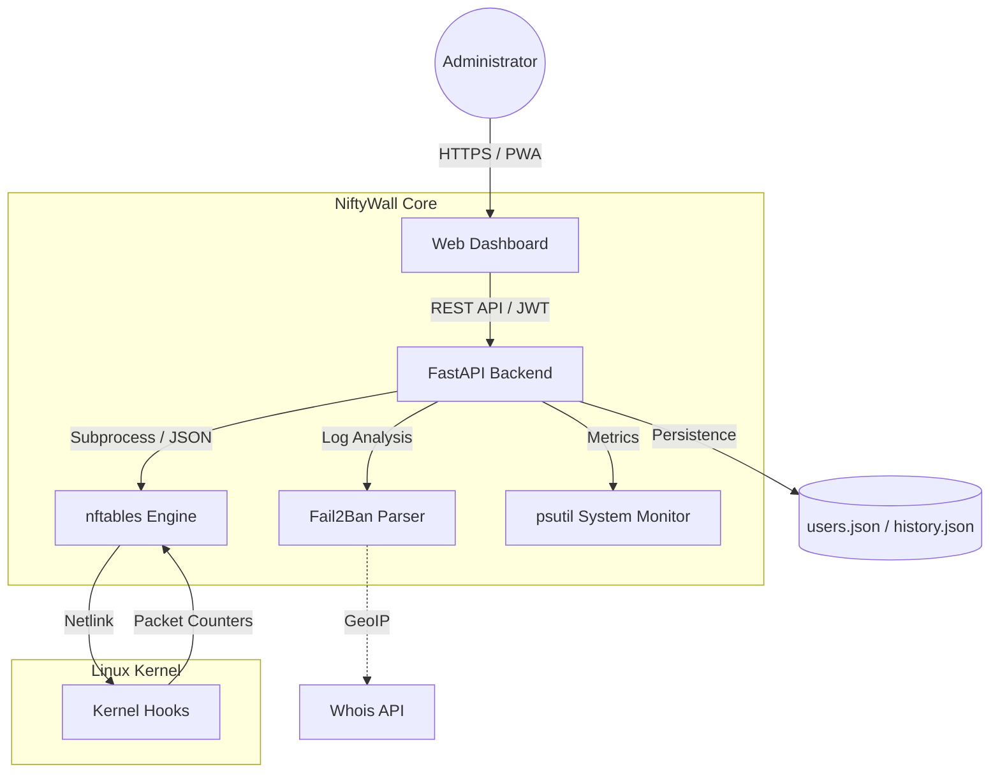

<p align="center">
  <a href="README_ENG.md">
    
  </a>
  <a href="README.md">
    
  </a>
</p>

# 🛡️ NiftyWall v1.5.2 "Smart Insights"
*Making Linux Firewalls Transparent, Smart, and Beautiful.*

[](https://github.com/weby-homelab/niftywall)
[](LICENSE)
[]()

**NiftyWall** is a professional web dashboard for managing `nftables`, built for those who value speed, aesthetics, and total control. Unlike UFW or Firewalld, NiftyWall doesn't create its own "rule world"; instead, it works directly with the Linux kernel, visualizing the real state of your firewall.

---

## 🧩 System Architecture



---

## ✨ New in Version 1.5.0 (Smart Insights)

- **📈 System Analytics:** Live CPU and RAM usage charts, plus Uptime stability history.
- **📱 Full Mobile Responsiveness:** New "card-based" interface for smartphones and scrollable tabs.
- **🚀 Easy Onboarding:** Instant first-admin registration upon initial launch.
- **🌍 Intelligent Whois:** Detailed ISP and country info for any IP in one click.
- **🛡️ Fail2Ban Pro:** Ability to unban IPs directly from the dashboard.

## 🚀 Key Advantages

- **Direct nftables Engine:** Works with native nftables JSON format. Zero conflicts with Docker rules.
- **🕰️ Time Machine (Snapshots):** Automatically takes configuration snapshots before every change. Safe one-click rollback.
- **📈 Activity Monitoring:** Sparklines for every rule show real-time traffic activity (pkts/sec).
- **🚨 Panic Mode 2.0:** Instant lockdown of all unnecessary traffic while maintaining SSH and NiftyWall access.
- **🔀 Smart NAT:** Easy port forwarding management with automatic FORWARD chain configuration.

---

## 🛠️ Quick Start

### Via Docker (Recommended)
```bash
docker pull webyhomelab/niftywall:latest
docker run -d --name niftywall --privileged --network host \
  -v /var/log/fail2ban.log:/var/log/fail2ban.log:ro \
  -v /var/run/fail2ban:/var/run/fail2ban \
  -v /opt/niftywall/snapshots:/app/snapshots \
  -v /opt/niftywall/data:/app/data \
  -e SECRET_KEY="your_secure_random_string_here" \
  webyhomelab/niftywall:latest
```
*Note: `--privileged` and `--network host` are required for direct interaction with nftables.*

### Manual Installation (Ubuntu 24.04)
```bash
git clone https://github.com/weby-homelab/niftywall.git
cd niftywall
python3 -m venv venv && source venv/bin/activate
pip install -r requirements.txt
cp .env.example .env
# Start the service via systemd (see documentation below)
```

---

## 📜 Update History
- **v1.5.0**: "Smart Insights" release. Charts, mobile UI, Unban, Whois.
- **v1.4.1**: Smart Clone & Edit, auto-snapshots, advanced NAT.
- **v1.3.0**: Fail2Ban integration (read-only), IP geolocation.

## 📋 System Requirements
- **OS:** Ubuntu 24.04 (LTS) or any modern Linux with Kernel 6.8+.
- **Engine:** nftables 1.0.9 or newer.
- **Access:** `root` privileges for rule management.

---
<p align="center">
  Made with ❤️ in Kyiv under air raid sirens and blackouts<br>
  <strong>✦ 2026 Weby Homelab ✦</strong>
</p>
