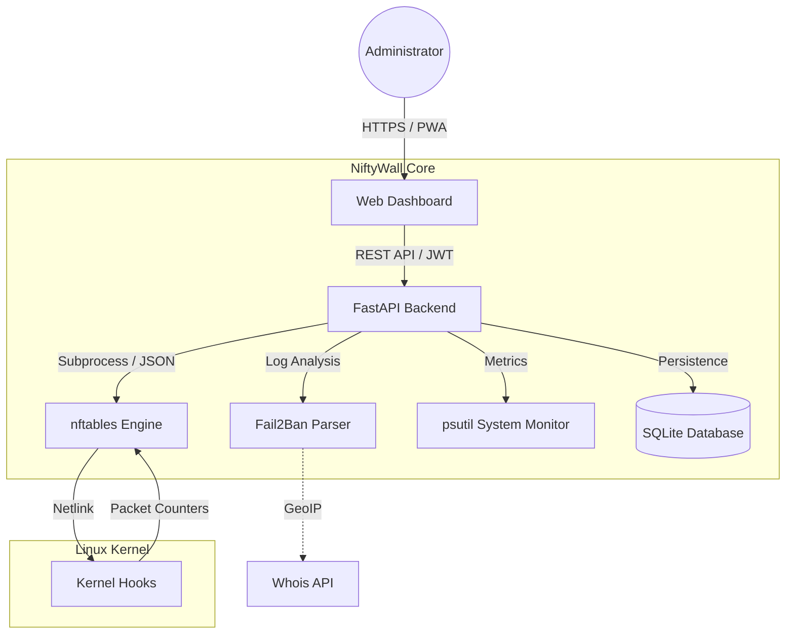

<p align="center">
  <a href="README_ENG.md">
    
  </a>
  <a href="README.md">
    
  </a>
</p>

<br>

<p align="center">
  
  
</p>

# 🛡️ NiftyWall v3.0.0 "Hardened" - Docker Edition [](https://github.com/weby-homelab/niftywall/releases/latest)

**NiftyWall** is a professional web dashboard for firewall management. In the v3.0.0 update, the project underwent a full audit and refactoring to achieve Enterprise-grade stability and security.

This branch (`main`) contains the **Docker Edition** of the project, optimized for quick and isolated deployments via Docker Compose.

---

## 🧩 System Architecture



---

## 🚀 What's New in v3.0.0 "Hardened"

- **🔐 SQLite Backend:** All states (users, logs, history) migrated from JSON files to a reliable SQLite database. Resolved Race Conditions.
- **🛡️ Strict Input Validation:** Implemented rigorous input validation via Pydantic Regex. Full protection against NFT injections.
- **🕰️ Isolated Time Machine:** Backup and Restore now work exclusively with the `niftywall` table. The system no longer affects Docker or VPN rules during rollback.
- **🚨 Dynamic Panic Mode:** Configure allowed ports and interfaces via environment variables (`PANIC_ALLOWED_PORTS`).
- **🔄 Smart DNAT + SNAT:** Automatic addition of Masquerade rules to eliminate asymmetric routing issues in NAT.
- **🕵️ Resilient Fail2Ban:** New parsing logic independent of log files, capable of querying status directly via `fail2ban-client`.

---

## 🛠️ Quick Start (Docker Edition)

The recommended way for a fast and isolated deployment.

```bash
# 1. Pull the latest image
docker pull webyhomelab/niftywall:latest

# 2. Run the system
docker run -d --name niftywall --privileged --network host \
  -v /var/log/fail2ban.log:/var/log/fail2ban.log:ro \
  -v /var/run/fail2ban:/var/run/fail2ban \
  -v /opt/niftywall/snapshots:/app/snapshots \
  -v /opt/niftywall/data:/app/data \
  -e SECRET_KEY=$(openssl rand -hex 32) \
  webyhomelab/niftywall:latest
```

*Note: `--privileged` and `--network host` are required for direct interaction with nftables.*

---

## 📥 Other Installation Options

For direct installation on the host system (Bare Metal), please use the [classic](https://github.com/weby-homelab/niftywall/tree/classic) branch.

---

## 📜 Update History
- **v3.0.0**: "Hardened" release. Full refactor, SQLite, security, and isolated backups.
- **v2.0.1**: Hotfix for UI layout and DNAT rule disambiguation in `inet` tables.
- **v2.0.0**: "Autonomy" release. Full rule isolation, seamless Docker compatibility without conflicts.
- **v1.5.0**: "Smart Insights" release. Charts, mobile UI, Unban, Whois.

---

## 📋 Detailed System Requirements and Environments

NiftyWall v2.0+ is built on the principle of **absolute autonomy**. By utilizing an isolated `inet niftywall` table with the highest chain priority (-100/-150), NiftyWall functions correctly across a wide range of environments.

### 🟢 1. Base Requirements
- **OS:** Ubuntu 24.04 (LTS), Debian 12, or any modern Linux with Kernel **6.8+**.
- **Engine:** `nftables` version **1.0.9** or newer.
- **Access:** `root` privileges (or `sudo`) for direct kernel rule management.

### 🟡 2. Mixed Environment (Servers with Docker / LXC)
*Servers actively utilizing containerization.*
- **Compatibility:** **Full (As of v2.0).** NiftyWall no longer conflicts with Docker.
- **Characteristics:** All your NiftyWall rules will be applied to the traffic **before** it ever reaches Docker's rules (priority -100). This allows you to safely block traffic before it hits your containers.

### 🔴 3. Hostile Environment (UFW or Firewalld active)
*Servers where another high-level manager is already running.*
- **Compatibility:** **Partial / Not Recommended.**
- **Solution:** NiftyWall is designed as a modern replacement. If you specifically need a GUI for these legacy systems, use: [UFW-GUI](https://github.com/weby-homelab/ufw-gui) or [Firewalld-GUI](https://github.com/weby-homelab/firewalld-gui).

---
<p align="center">
  Made with ❤️ in Kyiv under air raid sirens and blackouts<br>
  <strong>✦ 2026 Weby Homelab ✦</strong>
</p>
