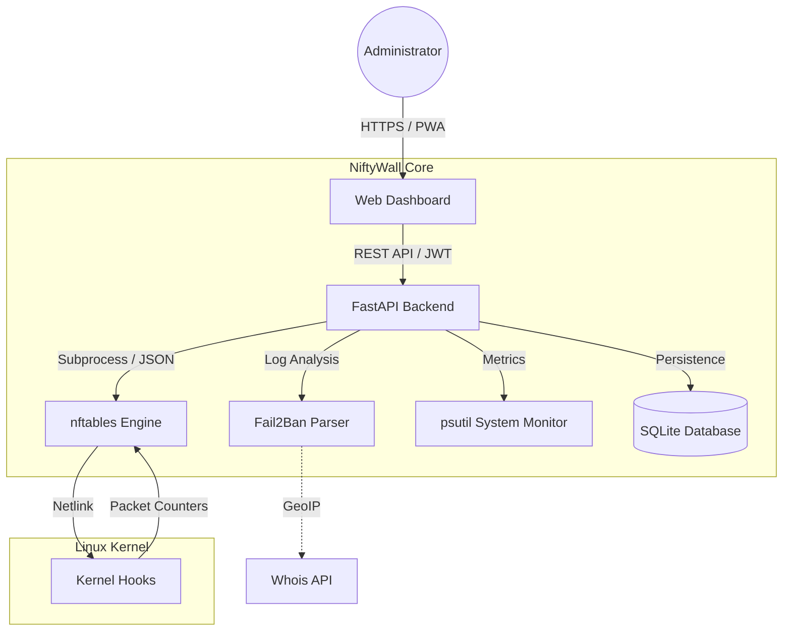

<p align="center">
  <a href="README_ENG.md">
    
  </a>
  <a href="README.md">
    
  </a>
</p>

<br>

<p align="center">
  
  
  
  
</p>

# 🛡️ NiftyWall v3.0.1 "Hardened" - Bare Metal Edition [](https://github.com/weby-homelab/niftywall/releases/latest)

*Making Linux Firewalls Transparent, Smart, and Beautiful.*

**NiftyWall** is a professional web dashboard for managing the nftables firewall. In the v3.0.1 update, the project underwent a full audit to achieve Enterprise-grade stability. This edition (`classic`) is optimized to run directly on the host system, providing maximum performance and direct access to the kernel's Netlink API.

---

## 🧩 System Architecture



---

## 🚀 What's New in v3.0.1 "Hardened"

- **🔐 SQLite Backend:** All states migrated to a reliable SQLite database. Resolved Race Conditions.
- **🛡️ Strict Input Validation:** Rigorous input validation via Pydantic. Full protection against NFT injections.
- **🕰️ Isolated Time Machine:** Backup and Restore work exclusively with the `niftywall` table, without affecting Docker or VPN rules.
- **🔄 Smart DNAT + SNAT:** Automatic addition of Masquerade rules to eliminate asymmetric routing issues.
- **🕵️ Resilient Fail2Ban:** New parsing logic capable of querying status directly via `fail2ban-client`.

---

## 🛠️ Installation (Bare Metal Edition)

Optimized for operation using Systemd and Uvicorn on pure Linux.

### 1. Prerequisites
- **Python** 3.10+
- **nftables** package (v1.0.9+)
- **fail2ban** package (for log analysis)
- **root** or **sudo** privileges

### 2. Step-by-Step Setup
```bash
# Clone the repository
git clone -b classic https://github.com/weby-homelab/niftywall.git /opt/niftywall
cd /opt/niftywall

# Setup Python environment
python3 -m venv venv
source venv/bin/activate
pip install -r requirements.txt

# Configure environment
cp .env.example .env
# Generate SECRET_KEY: openssl rand -hex 32
```

### 3. Systemd Configuration
Create `/etc/systemd/system/niftywall.service`:
```ini
[Unit]
Description=NiftyWall Firewall Dashboard
After=network.target nftables.service

[Service]
User=root
WorkingDirectory=/opt/niftywall
ExecStart=/opt/niftywall/venv/bin/uvicorn app.main:app --host 0.0.0.0 --port 8000
Restart=always

[Install]
WantedBy=multi-user.target
```
```bash
systemctl daemon-reload
systemctl enable --now niftywall
```

---

## 📋 Detailed System Requirements and Environments

### 🟢 1. Ideal Environment (Native Bare Metal / Cloud VPS)
*Transparent kernel management without intermediaries.*
- **How it works:** NiftyWall initializes the `inet niftywall` table in the `nftables` stack. It uses `filter` type for `input` and `forward` chains with **priority -100**, allowing packet processing at early stages of the network stack.
- **Features:** Highest rule processing speed and 100% predictability. No rule will be ignored by third-party services.

### 🟡 2. Mixed Environment (Servers with Docker / LXC / KVM)
*Harmonious coexistence with containerization.*
- **"Shield-First" Concept:** Thanks to **priority -100**, NiftyWall becomes the "first line of defense." Packets hit your rules **BEFORE** they are routed to the `DOCKER-USER` or `FORWARD` chains of the Docker package manager.
- **Table Isolation:** Operating in its own namespace (`table inet niftywall`) eliminates the risk of accidentally deleting Docker rules during configuration updates.

### 🔴 3. Hostile Environment (UFW or Firewalld active)
*Risk of conflicts and rule "shadowing".*
- **The Problem:** Since `nftables` allows multiple tables to work in parallel, a packet must be allowed in **both** systems simultaneously. This creates situations where NiftyWall allows traffic, but a legacy manager blocks it "in the shadow."
- **Solution:** It is recommended to execute `systemctl disable --now ufw` or `firewalld` before activating NiftyWall. If you specifically need a GUI for them, use: [UFW-GUI](https://github.com/weby-homelab/ufw-gui) or [Firewalld-GUI](https://github.com/weby-homelab/firewalld-gui).

---

## 📥 Other Options
For rapid deployment in an isolated environment, use the [main](https://github.com/weby-homelab/niftywall/tree/main) branch (Docker Edition).

---
<p align="center">
  Made with ❤️ in Kyiv under air raid sirens and blackouts<br>
  <strong>✦ 2026 Weby Homelab ✦</strong>
</p>
