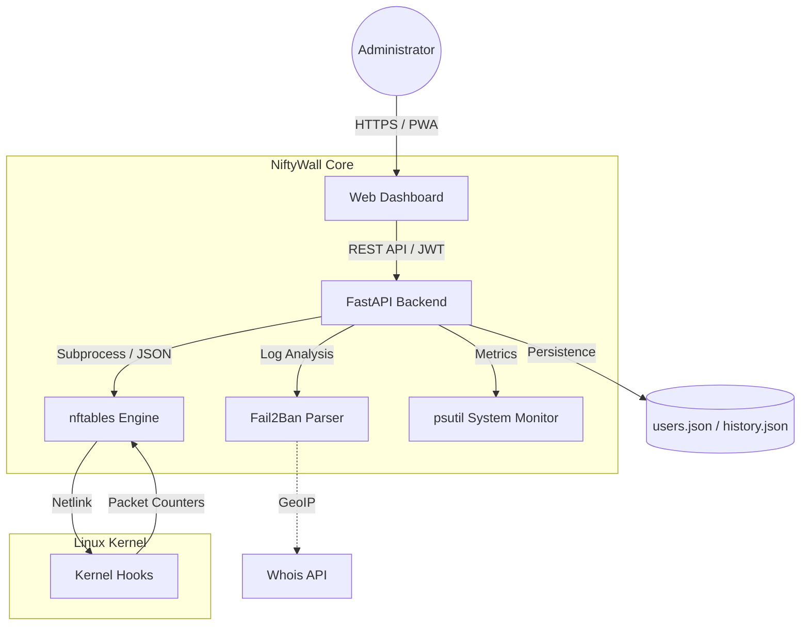

<p align="center">
  <a href="README_ENG.md">
    
  </a>
  <a href="README.md">
    
  </a>
</p>

# 🛡️ NiftyWall v2.0.0 "Autonomy"
*Making Linux Firewalls Transparent, Smart, and Beautiful.*

[](https://github.com/weby-homelab/niftywall)
[](LICENSE)
[]()

**NiftyWall** is a professional web dashboard for managing firewalls, built for those who value speed, aesthetics, and total control. In the v2.0.0 update, NiftyWall gained **full autonomy**: it no longer relies on system tables and doesn't conflict with Docker. It creates its own isolated table with the highest priority (`inet niftywall`), ensuring 100% reliability and security.

---

## 🧩 System Architecture



---

## ✨ New in Version 1.5.0 (Smart Insights)

- **📈 System Analytics:** Live CPU and RAM usage charts, plus Uptime stability history.
- **📱 Full Mobile Responsiveness:** New "card-based" interface for smartphones and scrollable tabs.
- **🚀 Easy Onboarding:** Instant first-admin registration upon initial launch.
- **🌍 Intelligent Whois:** Detailed ISP and country info for any IP in one click.
- **🛡️ Fail2Ban Pro:** Ability to unban IPs directly from the dashboard.

## 🚀 Key Advantages

- **Direct nftables Engine:** Works with native nftables JSON format. Zero conflicts with Docker rules.
- **🕰️ Time Machine (Snapshots):** Automatically takes configuration snapshots before every change. Safe one-click rollback.
- **📈 Activity Monitoring:** Sparklines for every rule show real-time traffic activity (pkts/sec).
- **🚨 Panic Mode 2.0:** Instant lockdown of all unnecessary traffic while maintaining SSH and NiftyWall access.
- **🔀 Smart NAT:** Easy port forwarding management with automatic FORWARD chain configuration.

---

## 🛠️ Quick Start

### Via Docker (Recommended)
```bash
docker pull webyhomelab/niftywall:latest
docker run -d --name niftywall --privileged --network host \
  -v /var/log/fail2ban.log:/var/log/fail2ban.log:ro \
  -v /var/run/fail2ban:/var/run/fail2ban \
  -v /opt/niftywall/snapshots:/app/snapshots \
  -v /opt/niftywall/data:/app/data \
  -e SECRET_KEY="your_secure_random_string_here" \
  webyhomelab/niftywall:latest
```
*Note: `--privileged` and `--network host` are required for direct interaction with nftables.*

### Manual Installation (Ubuntu 24.04)
```bash
git clone https://github.com/weby-homelab/niftywall.git
cd niftywall
python3 -m venv venv && source venv/bin/activate
pip install -r requirements.txt
cp .env.example .env
# Start the service via systemd (see documentation below)
```

---

## 📜 Update History
- **v2.0.1**: Hotfix for UI layout and DNAT rule disambiguation in `inet` tables.
- **v2.0.0**: "Autonomy" release. Full rule isolation, seamless Docker compatibility without conflicts.
- **v1.5.2**: Stability hotfixes for Smart Insights.
- **v1.5.0**: "Smart Insights" release. Charts, mobile UI, Unban, Whois.

## 📋 Detailed System Requirements and Environments

NiftyWall v2.0+ is built on the principle of **absolute autonomy**. By utilizing an isolated `inet niftywall` table with the highest chain priority (-100/-150), NiftyWall functions correctly across a wide range of environments.

### 🟢 1. Base Requirements (For all systems)
- **OS:** Ubuntu 24.04 (LTS), Debian 12, or any modern Linux with Kernel **6.8+**.
- **Engine:** `nftables` version **1.0.9** or newer.
- **Access:** `root` privileges (or `sudo`) for direct kernel rule management.

### 🟢 2. Ideal Environment (Native Bare Metal / Cloud VPS)
*Servers running without any additional firewall wrappers.*
- **How it works:** NiftyWall is the sole master of your network traffic.
- **Characteristics:** Highest rule processing speed, 100% predictability, perfect for high-load gateways, routers, or VPN servers.

### 🟡 3. Mixed Environment (Servers with Docker / LXC)
*Servers actively utilizing containerization.*
- **How it works:** Docker traditionally uses the `iptables-nft` subsystem, generating its own rules in system tables (e.g., `ip filter`, `ip nat`).
- **Compatibility:** **Full (As of v2.0).** NiftyWall no longer conflicts with Docker.
- **Characteristics:** All your NiftyWall rules will be applied to the traffic **before** it ever reaches Docker's rules. This allows you to safely block (Drop) malicious traffic before it hits the exposed ports of your containers.

### 🔴 4. Hostile Environment (UFW or Firewalld active)
*Servers where another high-level manager is already running (e.g., `ufw enable` or `systemctl start firewalld`).*
- **Compatibility:** **Partial / Not Recommended.**
- **Why:** UFW creates dozens of opaque micro-chains. While NiftyWall rules will trigger first (due to their high priority), any UFW restart might entirely overwrite the kernel configuration, leading to unpredictable behavior.
- **Solution:** NiftyWall is designed as a **replacement** for UFW/Firewalld. It is highly recommended to disable them (`ufw disable` or `systemctl disable firewalld`) before adopting NiftyWall.

---
<p align="center">
  Made with ❤️ in Kyiv under air raid sirens and blackouts<br>
  <strong>✦ 2026 Weby Homelab ✦</strong>
</p>
